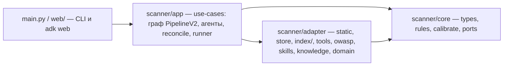

# Архитектура scanner — слои, порты, инварианты, источники

Документ отвечает на вопрос «почему код лежит так и чему это соответствует». Аудит расхождений — `docs/audits/`,
решения — `docs/adr/`, план исправлений — `docs/plans/quality.md`.

## Слои и правило зависимостей

Стрелки смотрят внутрь [CA, гл. 22 «The Clean Architecture», Dependency Rule; HEX]: `core` не импортирует ничего
нашего, `adapter` никогда не импортирует `app`, `app` зависит от `adapter` только через композиционный корень
`runner.py` (HEX «configurator»). Проверяется grep'ом импортов; аудит зафиксировал два отступления: `app`
местами импортирует конкретные адаптеры (`static`, `owasp`, `tools`) мимо портов, а `main.py` держит eval-логику.

| Слой | Ответственность | SOLID, который он воплощает | Где сейчас не дотягивает (аудит) |
|---|---|---|---|
| `core` | Типы (`Anchor`, `Hypothesis`, `Dossier`, `Finding`, `Threat`, `DomainMap`), чистые правила (`ground_hypothesis`, `validate_finding`, `check_consulted`, `calibrate`), порты (`ports.py`) | **DIP**: порты объявлены там, где их потребляют [CA, гл. 11]; **SRP** леса домена [DDD, гл. 4 «Isolating the Domain»] | инварианты в комментариях, а не в типах (`Literal`, `model_validator`) [types.md §1–2]; один порт (`Index`) на весь «шестиугольник» |
| `adapter` | Вторичные адаптеры (сканеры, SQLite State, LSP/grep-индекс, OWASP/skills/knowledge/domain) и первичный (`tools` — то, чем LLM дёргает систему) | **OCP** там, где есть таблицы (`LANGUAGES`, `REGISTRY`, `_WSTG`) [CA, гл. 8]; **LSP** у реализаций `Index` | `static.py` и `tools.py` — «God modules» [REF, Large Class/Divergent Change]; `Index` толстый — нарушение **ISP** [CA, гл. 10]; неявный порт `Index + failed` |
| `app` | Оркестрация ADK: граф `PipelineV2`, фабрики агентов, реестр специалистов и роутер, Reconciler, runner, наблюдаемость | **SRP** по модулям-стадиям; **OCP** реестра специалистов (новый специалист = запись в таблице) | `graph.py` смешивает fan-out, JSON, досье, критика; `store: Any`/`router: Any` вместо портов; env-флаги читаются в глубине [architecture.md §2–3] |
| `main.py`, `web/` | Транспорт: argparse и `adk web`; никакой логики прогона | **SRP** транспорта | `score`/`_ensure_target` в CLI; `sys.path`-хак в `web/` |

## Порты (целевое состояние, см. `docs/plans/quality.md`, ADR-0002/0003)

| Порт (`core/ports.py`) | Методы | Кто реализует | Кто потребляет |
|---|---|---|---|
| `SymbolLocator` | `find_symbol`, `has_symbol` | `LspIndex`, `GrepIndex`, `MultiIndex` | гейт заземления, Reconciler (синтетические якоря) |
| `Definitions` | `symbols`, `definition_range` | те же | `lsp_definition`, `lsp_symbols`, dominance |
| `CallGraph` | `references`, `callers`, `callees`, `path_to_entry` | те же | `lsp_*`-тулы taint/dependency, критики |
| `Closeable`, `Degradable` | `close`; `failed` | `LspIndex` (`failed`), все (`close`) | runner, `FallbackIndex` |
| `Index` | объединение четырёх | — | места, которым нужно всё |
| `RunStore` | `anchors`, `anchor`, `save_anchors`, `report`, `findings`, `put_hypotheses`, `put_dossiers`, `put_artifact`, `artifact`, `add_note`, `log_gate` | `store.Run`, `tests/fakes.FakeRun` | `_Graph`, `PipelineV2`, тулы |
| `Router` | `(item, lang, role) -> (name, suffix)` | `specialists.route_name` | `_Graph._pick` |

Разделение `Index` — ISP [CA, гл. 10]: каждый потребитель объявляет только то, чем пользуется; «Parse, don't
validate» [King] — порты принимают уже проверенные модели.

## Инварианты домена (DDD: правила живут в `core`, а не в промптах)

1. **Гипотеза заземлена**: `anchor_id` существующего якоря или символ, найденный индексом; `dependency` требует
   `consult=knowledge`, `authz` — `consult=domain` (`ground_hypothesis`).
2. **Находка = доказательство под гейтом** (`report_finding`): якорь существует; `cwe/file/line` либо пусты, либо
   совпадают с якорем (синтетический якорь без CWE принимает CWE модели); класс с обязательной консультацией несёт
   `knowledge:`/`domain:` в evidence; `confirmed` — хотя бы одна цитата дословно найдена в коде у якоря; секреты
   (CWE-798) редактируются до записи.
3. **Опровержение только контрфактом** (`disprove_finding`): цитата реально есть в коде цели; санитайзер засчитывается,
   только если `check_dominance` подтвердил доминирование над sink; статус становится `uncertain`, находка не удаляется.
4. **Артефакты стадий заземлены кодом** (`ground_artifacts`): сущности/угрозы/правила без символа в индексе уходят в
   `notes`/`gaps`, выдуманные `wstg_id` заменяются по таблице OWASP.
5. **Вердикт — из стора**, не из прозы модели (`dossier_from_store`).

## Раскладка после карты 47 (ADR-0009)

| Было | Стало |
|---|---|
| `adapter/static.py` | `adapter/scanners/{process,sarif,gosec,semgrep,osv,gitleaks,scan}.py` |
| `adapter/tools/{code,lsp,gates,rosters}.py` | `adapter/tools/<group>/<tool>.py` (`make(ctx)`), `registry.py` (`TOOLS`, `make(names, ctx)`), `context.py` |
| `app/{agents,instructions,specialists,knowledge_agent,domain}.py` | `app/agents/<name>/{agent,instruction,tools}.py`, `base.py`, `shared.py`, `registry.py` |
| `app/{pipeline,graph_nodes,graph,plan,reconcile}.py` | `app/graph/{workflow,stage,workers,helpers,planning,reconcile}.py`, `nodes/<node>.py` |

Направление внутри `app`: `agents/` ← `graph/` ← `runner`; guard — `tests/test_layers.py`.

## Отображение на Google ADK [ADK]

- Граф — статический `Workflow` ADK 2.9 (`scanner/app/graph/workflow.py`, ADR-0008): стадии Capella (Shannon) как
  рёбра графа, 24 узла + 2 служебных (`batches`, `provisional`). Конструкции выбраны по сути узла и проверены
  спайком (`tests/test_adk_spike.py`, план §6):

  | Конструкция | Узлы | Почему |
  |---|---|---|
  | `FunctionNode` | `scan`, `build_skeleton`, `direct_findings`, `recon`, `ground`, `batches`, `fold_triage`, `dedupe`, `mark_sample`, `provisional`, `calibrate`, `export`, четыре `route_*` | детерминированная работа; route-узлы отдают `Event(route=…)`, карта рёбер выбирает ветку |
  | `JoinNode` | `join_model` | единственный настоящий fan-in: Architect ∥ recon |
  | `@node(rerun_on_resume=True)` с `LlmAgent`-ребёнком | `architect`, `domain_modeler`, `threat_modeler`, `plan` | голый агент на статическом ребре не умеет деградировать (исключение валит Workflow); обёртка даёт таймаут, заметку и resume по артефакту |
  | `@node(parallel_worker=True)` над `LlmAgent` | `triage_sweep`, `review`, `critic` (viability), `confirm` | список → список, ADK раскладывает элементы; ошибка элемента ловится внутри |
  | динамический цикл | `audit` | единственный узел, форма которого зависит от данных: раунды до пустой очереди, лимита или бюджета; в раунде fan-out через `route_and_verify` |
  | обычный узел с несколькими входами | `export`, `calibrate` | `JoinNode` ждал бы ветку, которую маршрут пропустил (спайк Q2) |

  Лестница вердиктов Shannon → наши статусы: review VALID = confirmed; FALSE_POSITIVE только через
  `disprove_finding` с контр-цитатой; PROVISIONALLY_VALID / NEEDS_RESEARCH и viability — аннотации через
  `RunStore.annotate` (отказывает для status/evidence/confidence); promotion в `confirm` — повторный
  `report_finding` с большей confidence. Гейт SARIF остаётся `status == confirmed`, аннотации в `properties`.

- Узлы живут в `scanner/app/graph/nodes/<node>.py`, строятся фабриками на прогон (замыкание на `RunStore` и агентов).
  Параллельность — `@node(parallel_worker=True, max_parallel_workers=k)`: ADK раскладывает список элементов по
  воркерам; ошибка одного элемента ловится внутри узла (иначе ADK отменяет всю пачку). Роутер CWE → специалист
  остаётся в коде (`graph.pick_agent`), не в графе.
- Один `LlmAgent` на специалиста строится раз на прогон; активация — `ctx.run_node(agent, payload)`: payload
  (гипотеза/находка + скиллы + overlay) приходит моделью как user-ход, `include_contents="none"` не даёт истории
  расти между раундами. Клонов и подмены инструкций больше нет.
- `before_model_callback`: бюджет вызовов (per-branch, per-invocation для `AgentTool`, глобальный стоп только у
  корневых стадий) и окно результатов тулов; `before_tool_callback`: лог. Колбэки висят на агентах и работают
  под `run_node` без изменений.
- Таймаут стадии — `asyncio.wait_for` вокруг `run_node` внутри обёртки стадии (деградация до «нет артефакта»),
  не `timeout=` узла (это уронило бы Workflow).
- Resume: обёртка стадии пропускает её, если артефакт уже в State (CLI-перезапуск — новая ADK-сессия, replay
  ADK этого не покрывает). Консультанты как `AgentTool` (Knowledge) — отдельная инвокация со своим бюджетом.
- Состояние: `session.state` для счётчиков и `stop_reason` (ключи в `scanner/core/workflow.py`), SQLite State
  (`.state/state.db`) как источник правды, ADK-сессии в `.state/sessions.db` для `adk web`; спаны OTLP через
  `maybe_set_otel_providers`. `adk web` рендерит граф через `graph_serialization` (`/dev/apps/fullscan/build_graph`).

## Конвенции

- Именование по PEP 8: функции в snake_case (никаких `ROUTER`), константы в CAPS только для данных; докстринг — первая
  строка тела (PEP 257), обязателен у публичных вызываемых объектов и у всех тулов (это описание для модели).
- Приватные имена (`_x`) не импортируются из других модулей [GPSG 2.2]; что нужно снаружи — публикуется.
- Переменные окружения читаются только в `settings`/`runner` (ADR-0004); граф, стадии, адаптеры получают значения
  параметрами; код не знает про `PYTEST_CURRENT_TEST`.
- Тесты не являются библиотеками: общие фейки в `tests/fakes.py`, фикстуры в `tests/conftest.py` (ADR-0005);
  фейк стора обязан проходить `isinstance(fake, RunStore)`.
- Одна таксономия CWE (`core`), роутер и гейт выводят из неё (ADR-0006).
- `# ponytail:` помечает осознанный срез с потолком и путём апгрейда; срез, который уже закрыт, комментарий теряет.
- Слои проверяются тестом импортов (`tests/test_layers.py`, wave 1): `core` без наших импортов, `adapter` без `app`.

## Источники

- [CA] R. C. Martin, *Clean Architecture: A Craftsman's Guide to Software Structure and Design*, Prentice Hall, 2017 — гл. 7–11 (SOLID), гл. 22 (The Clean Architecture, Dependency Rule).
- [HEX] A. Cockburn, *Hexagonal Architecture* (Ports & Adapters), https://alistair.cockburn.us/hexagonal-architecture/
- [DDD] E. Evans, *Domain-Driven Design: Tackling Complexity in the Heart of Software*, Addison-Wesley, 2003 — гл. 2, 4.
- [REF] M. Fowler, *Refactoring: Improving the Design of Existing Code*, 2nd ed., Addison-Wesley, 2018 — гл. 3 (Bad Smells in Code).
- [King] A. King, *Parse, don't validate*, 2019, https://lexi-lambda.github.io/blog/2019/11/05/parse-don-t-validate/
- PEP 8 https://peps.python.org/pep-0008/ · PEP 20 https://peps.python.org/pep-0020/ · PEP 257 https://peps.python.org/pep-0257/ · PEP 484 https://peps.python.org/pep-0484/ · PEP 544 https://peps.python.org/pep-0544/ · PEP 586 https://peps.python.org/pep-0586/
- [GPSG] Google Python Style Guide, https://google.github.io/styleguide/pyguide.html — §2.2 Imports, §2.5 Global State, §3.8 Comments and Docstrings.
- [ADK] Google Agent Development Kit (Python) docs, https://google.github.io/adk-docs/ — Custom agents, Tools, Callbacks, Sessions & State, Multi-agent.
- [ADR] M. Nygard, *Documenting Architecture Decisions*, 2011, https://cognitect.com/blog/2011/11/15/documenting-architecture-decisions
- Инструкции стадий адаптированы из Mantis (Apache-2.0) через Shannon/Keygraph, OWASP-материалы CC BY-SA 4.0 — см. `THIRD_PARTY_NOTICES.md`.
