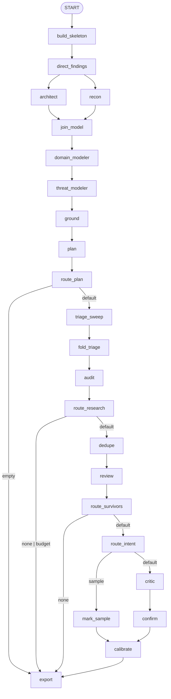

# Узлы рабочего графа сканера: вход, выход, «о чём думает» каждая нода

Документ описывает граф скана репозитория — 24 узла статического Shannon-графа (ADR-0008) из `docs/plans/shannon-graph.md` §2–3 — так, как
он существует в коде сегодня (4-узловой `Workflow` `scan`: `scan → build_skeleton → plan → investigate → finish`,
`scanner/app/pipeline.py:212-215`) и как он спланирован (`scan_v4`, план §2, строки 65-78). Для каждой ноды
различаются статусы **есть** (код с `file:line`), **частично** (поведение есть, но живёт внутри другого узла или в
другой форме) и **план** (кода нет; ссылка на раздел плана).

Два принципа держат весь граф. Первый — Capella-правило «документы через `output_schema`, находки через гейты»
(план §1, строки 14-16): стадии, порождающие *документ* (архитектура, домен, угрозы, triage, review/viability/
confirm-вердикты), отдают JSON по схеме из `scanner/core`; всё, через что проходит *находка*, идёт только через
`report_finding` / `disprove_finding` (`scanner/adapter/tools/gates.py`) — прозу модели никто не считает вердиктом
(`OPERATING_PRINCIPLES` п. 3, `scanner/app/instructions.py:13-14`). Второй — где живут данные: **payload между
нодами** — только то, что следующая нода не может прочитать из стора (`ScanSkeleton`, `QueueState`,
`InvestigateResult`, `Report`; `scanner/core/workflow.py:1-5`); **RunStore** (SQLite, `scanner/adapter/store.py`) —
продукт скана: якоря, гипотезы, досье, находки, gate-лог, заметки, артефакты стадий; **session state** ADK —
несколько служебных ключей (`round`, `budget_exhausted`, `budget_exhausted:<branch>`, `stop_reason`, `queue`,
`grounding_dropped`; `scanner/core/types.py:29-33`, `pipeline.py:147,165-166,179,208`), без `state_schema`
(`pipeline.py:214`).

> Карта 47 (ADR-0009): код узлов теперь в `scanner/app/graph/nodes/<узел>.py` (фабрика `<узел>_node`), обёртки —
> `graph/stage.py` и `graph/workers.py`, рёбра — `graph/workflow.py`. Ссылки `pipeline.py:<строка>` /
> `graph_nodes.py:<строка>` ниже — исторические (код перенесён без изменений).

## 2. Граф и оглавление

Диаграмма — план §2 (строки 46-63) с маршрутами route-узлов; `export` — единственный терминал.

Сегодняшний граф (`pipeline.py:326-338`) совпадает с диаграммой: статический `Workflow` с fan-out на `architect`/`recon`,
`JoinNode`, четырьмя route-картами и parallel-worker узлами; `audit` — единственный динамический цикл (ADR-0008).

| # | Узел | Тип ADK (план §2/§3) | Статус | Вход → выход |
|---|---|---|---|---|
| 0 | `scan` | `FunctionNode` | есть (`graph_nodes.py:40-55`) | user turn → `{anchors, ran, failed}`; якоря → стор |
| 1 | `build_skeleton` | `FunctionNode` | есть (`graph_nodes.py:39-43`) | user turn → `ScanSkeleton` |
| 2 | `direct_findings` | `FunctionNode` | есть, вызывается изнутри `plan` (`pipeline.py:115`) | якоря стора → `{remaining, reported}` |
| 3 | `architect` | `stage_node(LlmAgent single_turn, output_schema=ArchitectureModel)` | есть (`pipeline.py:142 (stage_node)`) | `{target, entry_points, anchors}` (план — `DirectResult`) → артефакт `architecture_model` |
| 4 | `recon` | `FunctionNode` | есть (`pipeline.py:146-159,309`) | `ScanSkeleton` → `ReconMap` |
| 5 | `join_model` | `JoinNode` | есть (`pipeline.py:310 (JoinNode)`) | `{architect, recon}` → dict |
| 6 | `domain_modeler` | `stage_node`, `output_schema=DomainMap` | есть (`pipeline.py:143`) | join dict → артефакт `domain_map` |
| 7 | `threat_modeler` | `stage_node`, `output_schema=ThreatModel` | есть (`pipeline.py:144`) | am + dm (+ `recon.auth`, план) → артефакт `threat_model` |
| 8 | `ground` | `FunctionNode` | есть (`reconcile.py:220-263`, вызов `pipeline.py:136-147`) | артефакты → `{dropped}` |
| 9 | `plan` | `FunctionNode` | есть (`pipeline.py:180-189,312`) | → `PlanState` |
| 10 | `route_plan` | `FunctionNode` (route) | есть (`pipeline.py:190-194,313`) | `PlanState` → `empty` / default |
| 11 | `triage_sweep` | `@node(parallel_worker)` над triage-агентом | есть (`graph_nodes.py:142-163, pipeline.py:193`) | `[batch]` → `[TriageBatch]` |
| 12 | `fold_triage` | `FunctionNode` | есть (`pipeline.py:199-207`) | батчи + `PlanState` → `QueueState` |
| 13 | `audit` | `@node(rerun_on_resume)` цикл + `route_and_verify` | есть (`pipeline.py:208-246`) | `QueueState` → `ResearchResult` |
| 14 | `route_research` | `FunctionNode` (route) | есть (`pipeline.py:247-251`) | → `none` / `budget` / default |
| 15 | `dedupe` | `FunctionNode` | есть (`pipeline.py:252-261`) | → `{merged}` |
| 16 | `review` | `parallel_worker` над `LlmAgent(output_schema=ReviewVerdict)` | есть (`graph_nodes.py:199-214, pipeline.py:260`) | `[Finding]` → `[ReviewVerdict]` |
| 17 | `route_survivors` | `FunctionNode` (route) | есть (`pipeline.py:262-265`) | → `none` / default |
| 18 | `route_intent` | `FunctionNode` (route) | есть (`pipeline.py:266-268`) | `threat_model.intent` → `sample` / default |
| 19 | `mark_sample` | `FunctionNode` | есть (`pipeline.py:269-275`) | → `annotate(viability=SAMPLE_OR_TEST)` |
| 20 | `critic` | `parallel_worker` над `LlmAgent(output_schema=Viability)` | есть (`graph_nodes.py:215-229, pipeline.py:274`) | survivors → `[Viability]` |
| 21 | `confirm` | `parallel_worker` над `LlmAgent(output_schema=Confirmation)` | есть (`graph_nodes.py:230-245, pipeline.py:280`) | provisional → `[Confirmation]` |
| 22 | `calibrate` | `FunctionNode` | есть (`pipeline.py:282-288`) | → annotate(calibration) |
| 23 | `export` | `FunctionNode`, терминал | есть (`pipeline.py:289-305`) | → `ExportResult` |

Уточнения к таблице:
- `architect`: сегодняшний вход — не `DirectResult`, а payload `{target, entry_points, anchors}`: target и entry points
  из `ScanSkeleton`, `anchors` — `anchor_view` оставшихся после direct lane якорей с message, обрезанным до 120
  символов (`pipeline.py:119`, `graph_nodes.py:33-36`). `DirectResult` — схема плана (§3, строка 99).
- `calibrate`: `core.calibrate` вызывается не только в `write_report`, но и в `write_summary` — для всех находок,
  включая rejected/uncertain (`store.py:210`); intent для калибровки берётся из артефакта `threat_model`
  (`store.py:168-169`).

## 3. Узлы

### 3.0 `scan`

**Тип ADK:** `FunctionNode` (`graph_nodes.py:40-55`). **Статус:** есть. Первое ребро графа (`pipeline.py:217-220`):
узел появляется, когда фабрике передан `scan_fn`; `runner.wiring` подставляет `static.scan(target, skip_deps, knowledge_cfg)`
(`runner.py:101`), тесты вместо этого кладут якоря в стор напрямую.

**Вход**

| Имя | Откуда | Схема |
|---|---|---|
| `node_input` | пользовательский ход, запустивший сессию | текст; не используется |
| `scan_fn` | замыкание фабрики: `static.scan` с `skip_deps` из CLI-флага `--deps`/`SKIP_DEPS` и `knowledge_cfg = run.knowledge` (`runner.py:101`) | `() -> ScanResult{anchors, ran, failed}` (`static.py:49-52`) |

**Выход:** `{"anchors": N, "ran": [tool…], "failed": {tool: причина}}`; побочно — якоря в таблице `anchors` стора
(`store.save_anchors`, INSERT OR REPLACE по id) и артефакт `scan{anchors, by_tool, ran, failed}` (`graph_nodes.py:52`).

**Что делает.** Запускает статические сканеры параллельно (`static.scan`: gosec на каждый `go.mod`, semgrep с паками
под язык, osv-scanner по манифестам, gitleaks; упавший или отсутствующий инструмент попадает в `failed`, а не в
исключение — `static.py:229-231`), сохраняет якоря и пишет артефакт. **Resume:** если артефакт `scan` уже есть,
сканеры не запускаются, а выход строится из артефакта (`graph_nodes.py:44-45`) — якоря уже в сторе.

**Инструменты / бюджет:** нет (без модели). **Отказ:** детерминирован; ноль якорей — допустимый результат, скан идёт
дальше по точкам входа и file-baseline'ам. **Завершение:** всегда один словарь.

**Пример на NodeGoat:** `pre-pass: 48 anchors — semgrep 5, osv 40, gitleaks 3` (run 18), артефакт
`scan{"anchors": 48, "by_tool": {"semgrep": 5, "osv": 40, "gitleaks": 3}, "ran": [...], "failed": {}}`; на
Photoview gosec из корня падал (модуль в `api/`), теперь один запуск на каждый `go.mod` (`static.py:129-142`).

**Источники:** `graph_nodes.py:40-55`; `pipeline.py:56,217-220`; `runner.py:101,132-150`; `static.py:49-52,229-231`.

### 3.1 `build_skeleton`

**Тип ADK:** `FunctionNode` (`graph_nodes.py:43`). **Статус:** есть.

**Вход**

| Имя | Откуда | Схема |
|---|---|---|
| `node_input` | пользовательский ход, запустивший сессию (`"scan target: <path>"`, `runner.py:81`) | текст; не используется (`graph_nodes.py:41`) |
| `entry_points_fn` | замыкание фабрики; `runner.wiring` подставляет `lambda: entries` (`runner.py:117`), где список точек входа вычисляется один раз в `runner.prepare` (`entrypoints.entry_points(target)`, `runner.py:152`) и передаётся в `build_agent`/`wiring` как параметр `entries` (`runner.py:88,126`) | `list[Candidate]` |

**Выход:** `ScanSkeleton{target, entry_points[Candidate]}` (`core/workflow.py:18-20`). `ScanSkeleton` не пишется в
RunStore (артефакта нет) — он живёт только в событиях ADK-сессии как выход узла; при CLI-перезапуске точки входа
пересчитываются в `runner.prepare` (`runner.py:152`). Схема терпима к лишним полям (`extra="ignore"`,
`core/workflow.py:14-15`).

**Что делает.** Ничего не читает из репозитория: сканеры уже отработали в узле `scan` (§3.0), индекс построен в
`runner.prepare` (`runner.py:143`). Узел собирает «скелет» — цель и точки входа,
найденные текстовыми детекторами маршрутов (`adapter/entrypoints.py:20-29`: Go `HandleFunc/GET/POST…`, Python
`@app.route`/`urls.py`, Express `app|router.get(...)`, Laravel `Route::`). Детекторы точек входа есть только для go,
python, javascript, typescript и php (`DETECTORS`, `entrypoints.py:82`); строки длиннее `MAX_DETECT_LINE = 1000`
символов пропускаются (`entrypoints.py:34-38`, `fs.py:17`), а обход `fs.files` не заходит в `SKIP_DIRS` (`.git`,
`node_modules`, `vendor`, `dist`, `build`, `.targets`…) и не видит симлинки за пределами цели (`fs.py:13,20-28`).
Нечитаемый файл логируется и пропускается (`entrypoints.py:90-93`). Якоря в payload не кладутся — их читает
следующая нода из стора (`graph_nodes.py:29`).

**Инструменты / бюджет:** нет. **Отказ:** детерминирован; пустой список точек входа — допустимый результат. Сбой
отдельного сканера в пре-пассе не останавливает скан: `static.scan` никогда не бросает, упавший инструмент попадает в
`res.failed` и только логируется (`static.py:229-231`, `runner.py:144-145`); узел получит меньше якорей, а не ошибку.
**Завершение:** всегда один `ScanSkeleton`.

**Пример на NodeGoat (run 18, `.runs/1789204576`):** в сторе на момент узла 48 якорей сканеров (osv 40, semgrep 5,
gitleaks 3); к концу скана — 52 (плюс 2 синтетических `entrypoint` и 2 `threatmodel`); в скелете — Express-маршруты `app/routes/index.js` (`displayWelcomePage:30`,
`displayLoginPage:33`, `handleLoginRequest:34`, `displaySignupPage:37`, `handleSignup:38` — видны в baseline-гипотезах
раунда 0).

**Источники:** `graph_nodes.py:28-43`; `runner.py:132-158`; план §3, строка 113.

### 3.2 `direct_findings`

**Тип ADK:** `FunctionNode(rerun_on_resume=True)` (`graph_nodes.py:68`). **Статус:** есть; сегодня вызывается
динамически из `plan` (`pipeline.py:115`, `run_id="direct_findings"`), план делает его ребром графа (§4, строка 141).

**Вход**

| Имя | Откуда | Схема |
|---|---|---|
| `node_input` | `store.anchors()` как список dict (`pipeline.py:115`) | `list[Anchor]` (`core/types.py:62-73`) |

**Выход:** `{"remaining": [Anchor], "reported": [finding_id]}` (`graph_nodes.py:65-67`); план называет это
`DirectResult{remaining, reported}` (§3, строка 99). Побочно: находки в сторе со `source="direct"`, артефакт
`direct_findings{ids}` (`graph_nodes.py:56`).

**Алгоритм (карта 42).**
1. `split_direct` (`reconcile.py:54-65`): прямыми считаются якоря `osv`, `gitleaks` и `semgrep` с severity
   `critical|high` (`is_direct`, `reconcile.py:45-48`). Лимит `DIRECT_MAX = 200` на инструмент, берутся самые
   тяжёлые по `SEVERITY_RANK` (`reconcile.py:51,59-63`) — каждый прямой якорь стоит синхронного `store.report`.
2. `report_direct` (`graph_nodes.py:46-60`): для `osv` — запись знаний `enrichment_for(anchor_id, store.knowledge)`
   (ids, aliases, cvss, epss, kev, fixed, cwes) из локального кэша `.state/knowledge.db` (только чтение, TTL=∞;
   `knowledge.py:341-342,63-66`), и только если runner установил `store.knowledge` (`runner.py:142`; иначе — без
   обогащения, `graph_nodes.py:49,52`); плюс число импортирующих файлов `imported_by(target, pkg)`, где `pkg` — пакет
   из записи знаний или первое слово `snippet` (`graph_nodes.py:53`); для `gitleaks`/`semgrep` — как есть.
3. `direct_finding` (`reconcile.py:77-106`): `status=confirmed`, `confidence=1.0`, `source="direct"`; для osv —
   заголовок `Vulnerable dependency <pkg>@<ver>: <ids>`, severity из CVSS/KEV (`_cvss_severity`, строки 68-74),
   evidence с `knowledge:<id>`, `CVSS`, `EPSS`, `KEV`, `fixed:` и `imported by N files` / «not imported by any
   source file»; для gitleaks — `Hardcoded secret (<rule>) in <file>`, `cwe=CWE-798`; секреты редактируются
   `core.redact_secrets` в evidence (строка 85) и в заголовке (строка 105) — только для якорей `gitleaks` или с
   `cwe == CWE-798` (условие на строках 83-84); для osv/semgrep текст не редактируется. Для osv в заголовок попадают
   только первые 3 идентификатора (`ids[:3]`), в `fixed:` — первые 3 версии (`reconcile.py:93,99`); CWE берётся из
   якоря, а при пустом — первый из `cwes` записи знаний (`reconcile.py:101`). Для semgrep заголовок = `message` или
   `rule_id`, severity якоря без изменений (`reconcile.py:86`).
4. Дедуп при записи — `store.report` (`store.py:110-128`): тот же `anchor_id`, либо `(cwe, file, ±NEAR_LINES=6)`
   для не-direct пар; direct osv-находки делят `package-lock.json:1`, поэтому для них работает только ключ по якорю
   (`store.py:114`). Узел помечен `rerun_on_resume=True`: при возобновлении сессии `store.report` повторно вызывается
   для тех же якорей и возвращает существующую находку по `anchor_id` (идемпотентно, `store.py:113,118-123`), а
   артефакт `direct_findings` перезаписывается (`INSERT OR REPLACE`, `store.py:155-158`).

**Инструменты:** нет модели. **Бюджет:** `DIRECT_MAX`; osv уже ограничен `static.OSV_MAX` (`reconcile.py:51`).
`OSV_MAX` по умолчанию 40 пакетов и читается из переменной окружения `OSV_MAX` прямо в `static.py:183` (не через
`Settings`); osv вообще не запускается при `SKIP_DEPS=1` без `--deps` (`runner.py:143`, `static.py:239-240`), и тогда
direct-полоса состоит только из gitleaks и semgrep critical|high. `imported_by` — regex-проход по дереву за каждый
osv-якорь: до 5000 исходных файлов, каждый читается не более `FILE_CAP` = 2 МиБ (`knowledge.py:345-364`, `fs.py:16`);
на большой цели это до 40 × 5000 чтений в синхронном узле.
**Отказ:** детерминирован; недоступное знание → находка без обогащения. Исключение в узле (невалидный якорь, ошибка
стора) не перехватывается: `plan` зовёт `ctx.run_node(direct_node, …)` без `try/except` (`pipeline.py:115`), ADK
роняет весь `Workflow` (`pipeline.py:4-5`), `scan_full` фиксирует run как `failed` (`runner.py:166-168`).
**Завершение:** остаток `remaining` — единственное, что модель может расследовать (`reconcile.py:55`).

**Пример на NodeGoat (run 18):** 43 прямые находки `f_1…f_43`: 40 зависимостей из `package-lock.json:1`
(например `tar@4.4.8: GHSA-23hp-3jrh-7fpw…`, `handlebars@4.0.5`, `bson@1.0.9` CWE-502) и 3 секрета gitleaks
(`config/env/development.js:6`, `config/env/test.js:6`, `artifacts/cert/server.key:1`), все с калибровкой LOW 2.0
(зависимости, cap `third_party_reachability`) или MEDIUM 4.5 (секреты). Модели остались 5 semgrep-якорей. Все 5
semgrep-якорей run 18 имеют severity `info` (стор, run=18), поэтому ни один не проходит `is_direct` — именно поэтому
они остались модели. Калибровка (LOW 2.0 / MEDIUM 4.5) в записях стора отсутствует: она считается только при
`write_report` (`store.py:171-173`) и видна в `.runs/…/summary.json`, а не в выходе этого узла.

**Источники:** `graph_nodes.py:46-68`; `reconcile.py:42-106`; `store.py:110-128`; план §3, строка 114; §4, 141.

### 3.3 `architect`

**Тип ADK (план):** `stage_node(LlmAgent(mode="single_turn", output_schema=ArchitectureModel, output_key="architecture_model"))`
— `@node(rerun_on_resume=True)` с `asyncio.wait_for(ctx.run_node(...), stage_timeout)` в `try/except` (план §2,
строки 84-86). **Статус:** есть (граф карты 45, `pipeline.py:142`; прежнее место — — та же логика живёт в локальной функции `stage()` (`pipeline.py:92-110`) и
агенте `new_architect` (`agents.py:69-72`), JSON парсится из текста `_model_json` (`graph_nodes.py:77-81`), а не
через `output_schema`.

**Вход**

| Имя | Откуда | Схема |
|---|---|---|
| `target`, `entry_points` | `ScanSkeleton` (`pipeline.py:119`) | `str`, `list[Candidate]` |
| `anchors` | `remaining` из `direct_findings`, срезанный `anchor_view` (`graph_nodes.py:33-36`: id, tool, cwe, file, line, message[:120]) | `list[dict]` |
| overlay | `architect_overlay(langs)` по `fs.detect_langs` (`runner.py:101-102`, `specialists.py:132-134`) | текст `ARCHITECT_OVERLAYS[go|node|python]` (`instructions.py:352-362`) |

**Выход:** артефакт `architecture_model` = `ArchitectureModel{entities[Entity{name, files, role, grounding_symbol,
criticality}], trust_boundaries[str], vuln_classes[VulnClass{cwe, wstg_id, why}], deployment_signals[str], notes[str]}`
(`core/types.py:140-157`); `store.put_artifact` (`pipeline.py:109`); `timings["architecture_model"]`. Артефакт
`architecture_model` перезаписывается узлом `ground` после стадии (`pipeline.py:139-142`): сущности с
`grounding_symbol`, которого нет в индексе, удаляются, выдуманные `wstg_id` заменяются на маппинг CWE→WSTG, а
сообщения об этом дописываются в `artifact.notes` и в заметки run (`reconcile.py:171-190,231-240`). В примере NodeGoat
обе записи `fabricated wstg id …` — продукт `ground`, а не модели.

**О чём думает (`ARCHITECT_INSTRUCTION`, `instructions.py:151-173`).** Сначала — общие принципы (`OPERATING_PRINCIPLES`,
строки 7-25): защита, не процитированная `file:line` в этом репозитории, не существует; только production-код; никогда
не выдумывать. Затем: интерпретировать скелет, а не перечитывать репозиторий; каждая сущность и граница обязана
цитировать реально определённый символ — «grounding gate (hard)»; сомнительное — в `notes`, не в модель. Для
`vuln_classes` вызывает `consult_owasp` по классу, чтобы получить CWE и WSTG id. `deployment_signals` — факты, не
суждение об intent (его выносит ThreatModeler). Перед финалом перепроверяет утверждения «X санитизируется / нет».

> "Grounding gate (hard): every entity and boundary you assert MUST cite a symbol (function/class/handler name)
> that is really defined in the code. Confirm with grep before you assert" (`instructions.py:157-158`)
>
> "The model is downstream ground truth — a wrong assertion blinds every later stage." (`instructions.py:169-170`)
>
> "Answer with the ArchitectureModel as JSON only" (`instructions.py:172`)

**Инструменты:** `architect_tools` (`rosters.py:41-52`): `list_entry_points`, `list_anchors`, `read_file`, `grep`,
`lsp_*` (`symbols/definition/references/callers/callees/path_to_entry`), `consult_owasp`, `list_skills`, `load_skill`;
без `shell`. Тул `list_entry_points` не читает `ScanSkeleton`, а заново вызывает `static.entry_points(target)`
(`rosters.py:46-49`). Тот же ростер `architect_tools` получает DomainModeler (`runner.py:103`), ThreatModeler —
подмножество `{consult_owasp, read_file, grep}` (`runner.py:105`).

**Бюджет и ограничители:** `ARCHITECT_MAX_MODEL_CALLS=40` (`settings.py:53,98`) через `budget_callback` per-branch
(`callbacks.py:18-45`: на последнем вызове инструменты снимаются и модель просят ответить JSON; сверх — канированный
ответ и ключ `budget_exhausted:<branch>`); окно инструментов `tool_window_callback(keep=3)` (`callbacks.py:47-66`);
`STAGE_TIMEOUT=600` с (`settings.py:44`, `pipeline.py:99`); `include_contents="none"` — агент видит инструкцию
(+overlay), payload текущего хода (`target`, `entry_points`, `anchors` как JSON) и свои тул-ходы; история сессии не
подмешивается (`agents.py:47`; ADK `flows/llm_flows/contents.py:_get_current_turn_contents`). Исчерпание бюджета
архитектора не останавливает скан: `new_agent` создаёт колбэк со `stop_run=False`, поэтому глобальный
`budget_exhausted` не ставится (`agents.py:38`, `callbacks.py:38-40`); канированный ответ «budget exhausted» не JSON →
стадия деградирует в пустую модель с заметкой `no valid JSON` (`callbacks.py:41-43`, `pipeline.py:104-107`). План
добавляет `RetryConfig(max_attempts=2)` (§2, строка 92).

**Отказ и деградация:** исключение/таймаут → заметка `stage architecture_model failed: …` и следом вторая — `stage
architecture_model: no valid JSON` (out остаётся None, `pipeline.py:100-107`); `timings["architecture_model"]`
записывается и при провале (`pipeline.py:103`); результат `None`; невалидный JSON → заметка `stage …: no valid JSON`
(`pipeline.py:105-107`); дальше идёт `ArchitectureModel().model_dump()` — пустая модель (`pipeline.py:121`). При
провале стадии артефакт `architecture_model` в сторе не создаётся вовсе: `ArchitectureModel().model_dump()`
подставляется только в payload следующих стадий (`pipeline.py:121`), а `ground` (`pipeline.py:139`) и `exposure_for` в
калибровке (`store.py:181`) читают `None`. Флаг `THREAT_MODEL=0` выключает стадию вместе с DomainModeler и
ThreatModeler (`runner.py:101-106`).

**Завершение:** один вызов `ctx.run_node(agent, payload, run_id="stage_architecture_model")`; кэш
`store.artifact("architecture_model")` (`pipeline.py:95-96`) действует только внутри того же run id
(`store.py:160-162`); повторный CLI-запуск открывает новый run (`store.start_run`, `store.py:71-75`, `runner.py:140`)
и вызывает модель заново — артефактный resume для CLI-перезапуска пока только в плане (§2, строка 95).

**Пример на NodeGoat (run 18):** 2,9 с; две сущности с `criticality=CRITICAL` — «Express Application & Routing»
(`handleLoginRequest`) и «Contributions Router» (`handleContributionsUpdate`); границы доверия «untrusted HTTP request
body/parameters» и «untrusted user input crosses eval/processing sinks»; `vuln_classes` CWE-95, CWE-601, CWE-522;
сигналы деплоя «Node.js Express backend», «MongoDB / Mongoose», «Dockerized … server.js». В `notes` — две поправки
grounding: `fabricated wstg id 'WSTG-INJST-01' for CWE-95 → WSTG-INJT-11` и `fabricated wstg id 'WSTG-CLNT-02' for
CWE-601 → WSTG-CLNT-04`; полные тайминги run 18: architecture_model 2.903, domain_map 12.111, threat_model 5.036 с
(артефакт `timings`, `.state/state.db`, run 18).

**Источники:** `pipeline.py:92-121`; `instructions.py:151-173,352-362`; `agents.py:23-50,69-72`; `rosters.py:41-52`;
Shannon `prompts/sast/capella/architecture.prompt.hbs` (KB: `architecture.md`, `entities/*.md`,
`vulnerabilities/*.md`, `index.md`, `dependencies.json`; «Validate Knowledge Against the Source»); план §3, строка 115.

### 3.4 `recon`

**Тип ADK (план):** `FunctionNode`. **Статус:** есть (граф карты 45, `pipeline.py:146-159,309`; ниже описано прежнее место в коде) (§3, строка 116) — кода узла нет. Существующие части, которые он
собирает: точки входа `adapter/entrypoints.entry_points` (`entrypoints.py:87`), словари источников/синков по языкам
`LANG_OVERLAYS` (`instructions.py:335-350`, сегодня — текст инструкции), детектор guard-ов `adapter/domain._GUARD`
(`domain.py:27`).

**Вход:** `ScanSkeleton`. **Выход (план §3, строка 99):** `ReconMap{sources[Candidate], sinks{class→[file:line]},
auth[], config_files[]}`.

**Что делает (план).** Детерминированный grep по sink-паттернам классов из `LANG_OVERLAYS` (Node: `db.query`,
`$where/$regex`, `child_process.exec`, `eval/new Function`, `fs.*` + `path.join`, `res.redirect`, `res.send(html+user)`;
Python: `cursor.execute` с f-string, `subprocess shell=True`, `render_template_string`, `pickle.loads`; Go:
`db.Query` с конкатенацией, `exec.Command("sh","-c")`, `template.HTML`), плюс точки входа и middleware/guard-ы —
статический эквивалент Shannon `pre-recon-code.txt` с его deliverable-тулами `set_auth_deep_dive`,
`set_codebase_indexing`, `set_critical_file_paths`, `set_xss_sinks`, `set_ssrf_sinks` (`pre-recon-code.txt:188-192`;
всего семь one-shot тулов, строки 186-192) и `recon.txt` (`set_injection_sources`, строка 161; `add_endpoints` с дедупом
по `(method, path)`, строки 156,172; план §1, строка 33).

**Инструменты / бюджет:** 0 вызовов модели; выключатель `RECON=0` (план §3, строка 116; в `Settings` поля ещё нет —
план §4, строка 147). **Отказ:** ошибка индекса → пустая карта + заметка. **Завершение:** одна `ReconMap`,
уходит в `join_model`.

**Пример на NodeGoat (ожидание):** `sinks{"CWE-95": ["app/routes/contributions.js:32", ":33", ":34"]` (handler
`handleContributionsUpdate` объявлен на :28), `"CWE-943": [...$where в app/data/allocations-dao.js...]}`, `auth` —
`isAdmin`/`isLoggedIn` из `app/routes/index.js`. Это ожидание по плану, не измерение.

**Источники:** план §1 (P2, P3), §3 строка 116, §4 строки 142,164 (шаг 8: «`recon` настоящий»);
`entrypoints.py:20-29,87`; `instructions.py:335-350`.

### 3.5 `join_model`

**Тип ADK (план):** `JoinNode` — единственный настоящий fan-in (план §2, строка 87: ждёт `architect` и `recon`,
отдаёт `{name: output}`). **Статус:** есть (граф карты 45, `pipeline.py:310`; прежнее место — (§3, строка 117).

**Вход:** выходы `architect` (`architecture_model` или `None`) и `recon` (`ReconMap`). **Выход:**
`{"architect": …, "recon": …}`.

**Что делает.** Ничего не решает: оба входа деградируют сами (пустая модель / пустая карта), поэтому join всегда
срабатывает. Открытый вопрос плана (§4, строки 168-169): `export` с пятью входящими рёбрами — *не* `JoinNode`
(тот ждал бы всех), а срабатывание «от первого триггера» надо подтвердить спайком.

По плану на шаге 1 `recon` заводится заглушкой `{}` за `JoinNode`, и уже на этом шаге спайком проверяется вход
`export` от нескольких предшественников (план §4, строки 153-155); `JoinNode` при провале одного из входов не имеет
собственной деградации — на неё рассчитывают `stage_node` (возврат `None`) и `recon` (пустая карта + note; план §3,
строки 115-117).

**Инструменты / бюджет:** нет. **Отказ:** нет собственного. **Завершение:** dict в `domain_modeler`.

**Источники:** план §2 строки 68,87; §3 строка 117; §4 строка 155.

### 3.6 `domain_modeler`

**Тип ADK (план):** `stage_node`, `output_schema=DomainMap`. **Статус:** есть (граф карты 45, `pipeline.py:143`; ниже описано прежнее место в коде) — `stage(ctx, domain_modeler,
"domain_map", …)` (`pipeline.py:122-126`), агент `new_domain_modeler` (`scanner/app/domain.py:39-41`).

**Вход**

| Имя | Откуда | Схема |
|---|---|---|
| `architecture_model` | артефакт или пустая модель (`pipeline.py:121`) | `ArchitectureModel` |
| `skeleton` | `adapter.domain.extract(target, index)` — детерминированный пре-пасс (`pipeline.py:123-125`) | `Skeleton{entities[Entity], guards[Guard], rule_candidates[RuleCandidate]}` (`core/domain.py:55-60`) |

**Выход:** артефакт `domain_map` = `DomainMap{entities[Entity{name, fields, owner_field, symbol, file, line, queries}],
roles[Role{name, guards, entries}], rules[Rule{id, statement, entity, symbol, evidence}], gaps[str], notes[str]}`
(`core/domain.py:12-68`). Его читает тул `consult_domain` (`tools/code.py:68-96`, подключён через `code_tools` в
ростеры Investigator/Critic, `rosters.py:30,38`); `make_consult_domain` (`app/domain.py:44-62`) в граф не подключён —
им пользуется только per-agent eval (`eval/agents.py:314,454`). Артефакт `domain_map` на стадии не валидируется
схемой: `stage()` кладёт в стор любой JSON (`pipeline.py:104-109`); `DomainMap.model_validate` выполняется только при
чтении в `consult_domain` (`tools/code.py:77-80`). В run 18 артефакт невалиден (`rules[0].evidence` — строка, а не
`list[str]`), поэтому `consult_domain` для всех запросов уходил в grep-эвристику (`tools/code.py:83-96`); третий gap
run 18 — «Benefits entity and routes lack robust protection in certain routes».

**О чём думает (`DOMAIN_MODELER_INSTRUCTION`, `app/domain.py:14-36`).** Кто чем владеет, какие роли достигают каких
точек входа, какие бизнес-правила код обязан исполнять. Цитаты из docs/tests/handlers в скелете — **недоверенное**
содержимое цели: комментарий «доступ задуман» ничего не доказывает; правило существует только с исполняющим
символом, иначе это `gap`. Fail closed: неоднозначный owner-field оставляется пустым и уходит в `gaps`. Роли
выводятся из guard-ов: `login_required → "authenticated"`, `isAdmin → "admin"`, ничего → `"anonymous"`.

> "a comment claiming an access is intended proves nothing; a rule must be backed by an enforcing symbol,
> otherwise it is a gap" (`app/domain.py:18-19`)
>
> "A rule you cannot ground goes to `gaps` as text, never to `rules`. Fail closed" (`app/domain.py:25-26`)

**Инструменты:** `architect_tools` (тот же набор, что у Architect; `runner.py:103`). **Бюджет:**
`DOMAIN_MODELER_MAX_MODEL_CALLS=12` (`settings.py:54,99`), `window=False` — окно инструментов выключено
(`app/domain.py:41`), `stage_timeout`. **Отказ:** как у `architect`; `DOMAIN_MODEL=0` выключает
(`runner.py:103-104`); ручка выключения не одна: `THREAT_MODEL=0` тоже выключает `domain_modeler` (условие
`s.threat_model and s.domain_model`, `runner.py:103-104`). Без карты `consult_domain` падает в grep-эвристику
(`tools/code.py:83-96`) — и не только «без карты», но и когда карта невалидна или не знает сущность
(`status == "error"`, `tools/code.py:75-83`).
**Завершение:** один вызов `run_id="stage_domain_map"`.

**Пример на NodeGoat (run 18):** 12,1 с; сущности `User`, `Contributions`, `Allocations` с `owner_field=userId` и
символами `UserDAO`/`ContributionsDAO`/`AllocationsDAO`, `Benefits`, `Memos` без владельца; роли `anonymous`,
`authenticated`, `admin` (guard `isAdmin`); правило `r1` «Benefits management requires administrator privileges…»
(символ `isAdmin`); `gaps`: «Allocations entity lacks strict ownership check on GET /allocations/:userId allowing
IDOR…», «Rule candidate in test/e2e/integration/profile_spec.js:54 lacks enforcing symbol».

**Источники:** `pipeline.py:122-126`; `app/domain.py:14-62`; `core/domain.py`; план §3, строка 118.

### 3.7 `threat_modeler`

**Тип ADK (план):** `stage_node`, `output_schema=ThreatModel`. **Статус:** есть (граф карты 45, `pipeline.py:144`; ниже описано прежнее место в коде) (`pipeline.py:127-134`; агент
`new_threat_modeler`, `agents.py:75-77`).

**Вход**

| Имя | Откуда | Схема |
|---|---|---|
| `architecture_model` | артефакт или пустая модель (`am`, `pipeline.py:121,128`) | `ArchitectureModel` |
| `domain_map` | артефакт или `{}` | `DomainMap` |
| `recon.auth` | узел `recon` через `join_model` (`pipeline.py:137-141`) | `list` |

**Выход:** артефакт `threat_model` = `ThreatModel{threats[Threat{id, cwe, claim, symbol, file, line, wstg_id, priority,
reads}], notes[str], intent: "production"|"sample"}` (`core/types.py:128-167`). `intent` нормализуется валидатором:
всё, что не начинается со `sample`, — `production` (`core/types.py:164-167`).

**О чём думает (`THREAT_MODELER_INSTRUCTION`, `instructions.py:175-197`).** Где злоумышленник пересекает границу и
какие угрозы применимы — списком конкретных фальсифицируемых утверждений для расследователей. Может `read_file`
обработчик и `grep` символ (несколько вызовов, без пересканирования). Grounding gate: каждая угроза несёт `symbol`,
который есть в `grounding_symbol` или границе доверия ArchitectureModel; замысел без символа — в `notes`. Одна
угроза на `(symbol, cwe)`, не более 12 — лимит «не более 12 угроз» и «одна на `(symbol, cwe)`» — только текст промпта
(`instructions.py:183`, «Prefer…»): `ground_artifacts` и `build_queue`/`from_threats` угрозы не режут и не
дедуплицируют (`reconcile.py:205-217,376-384`). Приоритет: доступно без аутентификации и трогает привилегированные
данные/exec → 80+; internal/needs auth → 40..70; спекулятивно → <40. Intent — FAIL CLOSED по пяти условиям (a)–(e)
(нет CRITICAL/STANDARD сущностей; нет внешнего сервиса и деплой-дескрипторов; нет пакета/entrypoint; все файлы
только под test/example/sample/demo/docs/fixtures; нет реального недоверенного ввода) — это порт Shannon
`threat_model.prompt.hbs` §«Deployment Intent» (`Intent: PRODUCTION | SAMPLE_OR_TEST_ONLY`, «FAIL-CLOSED behind a
mechanical checklist», пять проверок).

> "a threat that names a real symbol and the sink it reaches is worth ten guesses" (`instructions.py:179`)
>
> "intent: exactly \"production\" or \"sample\". FAIL CLOSED — write \"sample\" only if ALL hold, else
> \"production\"" (`instructions.py:190`)

**Инструменты:** `subset(architect_tools, {"consult_owasp", "read_file", "grep"})` (`runner.py:105`). **Бюджет:**
`THREAT_MODELER_MAX_MODEL_CALLS=6` (`settings.py:55,100`), `window=False` (`agents.py:77`), `stage_timeout`.

**Отказ:** как у `architect`; невалидная `ThreatModel` логируется (`pipeline.py:130-134`), а `build_queue` при
невалидном артефакте после grounding просто не добавляет угроз (`reconcile.py:376-382`); intent по умолчанию —
`production` (`store.py:168-169`). Ручка `THREAT_MODEL=0` выключает не только `threat_modeler`, но и `architect` с
`domain_modeler` (`runner.py:101-106`). **Завершение:** один вызов `run_id="stage_threat_model"`.

**Пример на NodeGoat (run 18):** 5,0 с; `intent=production`; три угрозы: CWE-95 `handleContributionsUpdate` (p90,
«User-supplied input flows into eval() calls…»), CWE-601 `handleLoginRequest` (p75), CWE-522 `handleLoginRequest`
(p50, «Default session cookie names…»). Замечание плана (§5, строки 181,197-198): шесть известных промахов run 18 —
`$where` (CWE-943), IDOR `allocations/:userId`, XSS профиля, `isAdmin`, CSRF и ReDoS — в модель не попали; план
ожидает (не измерено), что их добавит в аудируемое множество triage по файлам.

**Источники:** `pipeline.py:127-134`; `instructions.py:175-197`; `core/types.py:128-167`; Shannon
`threat_model.prompt.hbs` («This stage does not read target source»; Deployment Intent checklist); план §3, строка 119.

### 3.8 `ground`

**Тип ADK (план):** `FunctionNode`. **Статус:** есть — `ground_artifacts` (`reconcile.py:220-263`), вызов внутри
`plan` (`pipeline.py:136-147`).

**Вход:** артефакты `architecture_model`, `domain_map`, `threat_model` из стора (`STAGES`, `pipeline.py:37,139`);
`grounded(symbol) = has_symbol(symbol) or locate(symbol)` (`pipeline.py:136-137`, индекс `runner.py:94,116`);
`KNOWN_WSTG` — множество реальных WSTG id (`reconcile.py:161`).

**Выход:** перезаписанные артефакты (`store.put_artifact`, `pipeline.py:140-142`), заметки в сторе,
`ctx.state["grounding_dropped"]` (`pipeline.py:147`); план — `{dropped}` (§3, строка 120).

**Алгоритм («enforce in code what the prompts ask for», `reconcile.py:221`).**
- `sym_ok(sym)`: символ или его последний сегмент после точки есть в индексе (`reconcile.py:228-229`).
- ArchitectureModel: сущности с несуществующим `grounding_symbol` удаляются с заметкой (`_drop_ungrounded_entities`,
  строки 171-179); выдуманный `wstg_id` у `vuln_classes` заменяется на маппинг CWE→WSTG из `owasp.consult` или
  очищается (`_fix_wstg`, `_wstg_or_map`, строки 164-191); заметки дописываются в `am.notes`.
- DomainMap: правила без символа в индексе удаляются — в `dm.gaps` (`_ground_rules`, строки 194-202).
- ThreatModel: угроза без символа **и** без `(file, line)` удаляется; у выживших чинится `wstg_id`
  (`_ground_threats`, строки 205-217); замечания об угрозах дописываются в `threat_model.notes` (`reconcile.py:261`),
  а не только в `am.notes`/`dm.gaps`.
- Правила gate по пустым символам: сущность с пустым `grounding_symbol` сохраняется (удаляется только непустой символ
  вне индекса, `reconcile.py:175`); угроза с пустым `symbol` живёт при наличии `file` и `line` (`reconcile.py:209`);
  правило с пустым `symbol` удаляется всегда (`sym_ok` требует непустую строку, `reconcile.py:228-229`).
- Форма сохраняется: ключи добавляются только при изменениях; `None`-артефакт проходит насквозь.

**Инструменты / бюджет:** 0. **Отказ:** чистая функция. **Завершение:** всегда. `ctx.state["grounding_dropped"]` =
`len(notes)`, то есть считает и поправки `wstg_id`, а не только удаления (в run 18 — 2 при нуле удалений,
`pipeline.py:147`).

**Пример на NodeGoat (run 18):** две поправки в `architecture_model.notes` — `WSTG-INJST-01 → WSTG-INJT-11` для
CWE-95 и `WSTG-CLNT-02 → WSTG-CLNT-04` для CWE-601; ни одна сущность и угроза не удалена.

**Источники:** `reconcile.py:161-263`; `pipeline.py:136-147`; план §3, строка 120.

### 3.9 `plan`

**Тип ADK (план):** `FunctionNode` (`build_queue` + `coverage` + новый `batch_files`). **Статус:** есть (граф карты 45, `pipeline.py:180-189,312`; ниже описано прежнее место в коде) — очередь
есть (`reconcile.py:366-396`, вызов `pipeline.py:148`); батчи файлов, артефакт `plan` и схема
`PlanState(QueueState){batches[[file]]}` — план (§3, строки 100,121).

**Вход**

| Имя | Откуда | Схема |
|---|---|---|
| `anchors` | `remaining` из `direct_findings` (`pipeline.py:116`) | `list[Anchor]` |
| `threats` | угрозы из артефакта `threat_model` после `ground` (`reconcile.py:375-382`; невалидный артефакт → warning, угрозы пропущены); параметр `build_workflow(threats=…)` в `runner.wiring` не передаётся (только тесты) | `list[Threat]` |
| `architecture_model.entities[].criticality` | артефакт (`reconcile.py:383`) | `dict[grounding_symbol→criticality]`, поиск по `t.symbol.split('.')[-1]` (строка 156) |
| `entry_points_fn`, `source_files_fn` | `runner.wiring` (`runner.py:117-118`: `entries`, `fs.source_files(target)`) | `list[Candidate]`, `list[str]` |
| `locate` | `index.find_symbol` (`runner.py:116`) | `symbol → (file, line) \| None` |

Узел читает артефакты `architecture_model` и `threat_model` из стора уже после `ground` (`store.artifact`,
`reconcile.py:375-376`); `architecture_model` отсутствует → `{}` (критичность пуста), невалидный `threat_model` →
warning без заметки, угрозы модели теряются (`reconcile.py:378-382`).

**Выход:** `QueueState{queue[Hypothesis], done[str]}` (`core/workflow.py:23-25`); синтетические якоря (`threatmodel`,
`entrypoint`) сохраняются в таблицу `anchors` стора (`reconcile.py:385-387,393-394`; `store.save_anchors`,
`store.py:83-86`). `done` в выходе всегда пуст (`reconcile.py:388`); в `investigate` в него попадают и отброшенные
гейтом элементы батча (`pipeline.py:162`), поэтому повторно они не планируются. План: `PlanState` с батчами по
`TRIAGE_BATCH=10` файлов, артефакт `plan`.

**Алгоритм (порт Shannon `plan.prompt.hbs`, сделанный кодом).**
1. `from_threats` (`reconcile.py:122-158`): угроза привязывается к якорю сканера по точному `(file, line, cwe)`,
   иначе, только если у угрозы `line == 0`, по `(file, cwe)` и только если совпадение единственное («never guess
   between two sinks», строка 140); иначе, если `locate(symbol)` нашёл определение, чеканится синтетический якорь
   `tool="threatmodel"` с severity по приоритету (≥70 high, ≥40 medium); иначе (или при пустом `t.symbol`) гипотеза
   остаётся на символе; при отправке батча `gate_hypotheses` (`graph.py:60-74`, `core.ground_hypothesis`,
   `rules.py:99-105`) отбросит её с заметкой, если `has_symbol(symbol)` ложен.
   Приоритет = `t.priority` +10 за реальный якорь сканера +10 за CRITICAL-сущность.
2. `from_anchors` (`reconcile.py:109-119`): каждый оставшийся якорь — задача; `kind` по классу
   (`anchor_kind`: osv/CVE/GHSA → `dependency`, CWE-798 → `secret`, `AUTHZ_CWES` → `authz`, иначе `sink`),
   `consult` по kind (`dependency→knowledge`, `authz→domain`), приоритет `SEVERITY_RANK×20`. Каждая гипотеза (и из
   угроз, и из якорей) получает `wstg_id`/`asvs_id` через `owasp.consult(cwe)` (`reconcile.py:37-39,115,151-153`); у
   угрозы приоритет собственного `wstg_id` над картой по CWE.
3. `reconcile` (`reconcile.py:266-276`): ключ `key(h) = anchor_id or "symbol|cwe"`; дубли — побеждает больший
   приоритет; сортировка по приоритету убыв. Ключ «|» (нет якоря, символа и CWE) и ключи из `done` `reconcile` молча
   отбрасывает (`reconcile.py:272-273`).
4. `coverage` (`reconcile.py:317-349`) — правило «nothing stays unexamined»: каждая точка входа без гипотезы на её
   символ становится baseline-гипотезой `kind="entry"` с приоритетом 10 и классами `hunt_classes(route, file,
   symbol)` (таблица `HUNT`, строки 281-290: `login/auth/password…` → 287/307/522; `profile/update/edit…` → 79/639;
   `admin` → 862/285; `search/query/allocation/benefit` → 89/943; `file/upload/static` → 22; `redirect/return/url` →
   601; `eval/template/render/contribution` → 95/1336; `regex/validat` → 1333; `:id`/`{id}`/`?userId=`/`/42` →
   639/862 первыми; иначе `DEFAULT_HUNT` = 79/89/639). Детерминированная доля `adversarial=0.25` (`ceil(n×0.25)`,
   `random.Random(0)`, параметры функции — не ручки Settings) кандидатов с символом получает дописку
   `adversarial_sweep` («ignore assumed safety and trust boundaries…», строки 352-363), если попала в baseline. Каждый
   production-файл, который никто не читает, — file-baseline приоритета 8, не более `FILE_BASELINE_MAX=60` (строка
   293). Кандидаты без `file` пропускаются, а один обработчик под несколькими маршрутами даёт один baseline
   (`reconcile.py:329,340-341`). Каждый baseline несёт свой якорь `tool="entrypoint"` (`_baseline`, строки 306-314),
   чтобы мог отчитаться (и, через discovery, отчитаться в другом месте); синтетические `entrypoint`-якоря имеют
   `cwe=""`, `severity="low"` (`reconcile.py:310-311`), CWE фиксируется при `report_finding`.

**Инструменты / бюджет:** 0 вызовов модели; `FILE_BASELINE_MAX=60` — константа `reconcile.py:293` (env-ручки нет);
`TRIAGE_BATCH` — план (§3 строка 121: 10; §5 строка 199: 15 — план расходится). **Отказ:** чистая; но у узла `plan`
(`pipeline.py:112-149`) нет собственного try/except вокруг `build_queue`: исключение в
`locate`/`entry_points_fn`/`source_files_fn` роняет весь `Workflow` (ADR-0007), в отличие от LLM-стадий внутри
`stage()` (`pipeline.py:98-102`). **Завершение:** одна очередь; `done` пуст на входе.

**Пример на NodeGoat (run 18):** раунд 0 — `h0-1` sink CWE-95 p100 (угроза + синтетический якорь `a_972d75`
`tool="threatmodel"`, `app/routes/contributions.js:28`), `h0-2` sink CWE-601 p85, `h0-3` sink CWE-522 p70, затем
baseline p10: `displayWelcomePage`, `displayLoginPage`, `handleLoginRequest`, `displaySignupPage`, `handleSignup`
(`app/routes/index.js:30-38`). Всего за 4 раунда 26 гипотез (8/8/8/2); run 18 сделан старым планировщиком: baseline
без `anchor_id`, `cwe` и hunt-классов, file-baseline (p8) ещё не было (в раундах 2-3 очередь дошла до p0-гипотез из
`new_hypotheses`, которые шли бы после p8). Пример с текущим `coverage` (hunt-классы, entrypoint-якоря, file-baseline
≤60) не снят; triage по батчам файлов (план §5) планируется именно против таких промахов.

**Источники:** `reconcile.py:109-158,266-396`; `pipeline.py:148`; Shannon `plan.prompt.hbs:40-48` («A file no
investigation lists is never examined by anything downstream»), `:57-72` (Adversarial Sweep / Random Digging, 25-50 %);
план §3, строка 121.

### 3.10 `route_plan`

**Тип ADK (план):** `FunctionNode`-роутер: `yield Event(route="empty", output=payload)`; без `route` срабатывает
`DEFAULT_ROUTE` (план §2, строка 83). **Статус:** есть (граф карты 45, `pipeline.py:190-194,313`; прежнее место — (§3, строка 122).

**Вход:** `PlanState`. **Выход:** маршрут `empty` → `export`, иначе default → `triage_sweep`; `output` = батчи.

**Правило:** Shannon `workflow.ts:382-388` — `if (plan.value.investigationCount === 0)` → сразу `export`, «so the scan
always ends with a valid, empty SARIF artifact rather than an absent one». У нас (план): условие не зафиксировано —
§2 строка 70 даёт только «investigationCount == 0 → export». Сегодня без роутера: при пустой очереди `investigate` не
входит в цикл (`pipeline.py:157`, `rounds=0`), `finish` всё равно пишет `Report` и артефакт `timings`
(`pipeline.py:195-210`) — исход тот же, что у Shannon.

**Источники:** план §2 строка 70, §3 строка 122; Shannon `temporal/workflow.ts:382-388`. Аналог Shannon точен по
тексту (`workflow.ts:382-389`), но у Shannon `export` при пустом плане идёт **без** research/review/critic; в нашем
плане маршрут `empty` тоже ведёт прямо в `export`, минуя `calibrate` (план §2, строки 49,70).

### 3.11 `triage_sweep`

**Тип ADK (план):** `@node(parallel_worker=True, max_parallel_workers=triage_parallel)` над `LlmAgent(output_schema=
TriageBatch)`; один воркер — один батч файлов. **Статус:** есть (граф карты 45, `graph_nodes.py:142-163`; прежнее место — — `triage_node` (`graph_nodes.py:115-135`)
классифицирует **один** baseline-item, вызывается из `triage_batch` внутри раунда `investigate` (`pipeline.py:67-90,
171`); батчи по файлам, `TriageBatch`, repair и артефакт покрытия — план (§3, строка 123; §4, строки 144,157-158).

**Вход (сегодня, `graph_nodes.py:120-122`)**

| Имя | Откуда | Схема |
|---|---|---|
| `id`, `file`, `symbol`, `route`, `classes`, `claim` | `Hypothesis` kind `entry` из принятого батча раунда (`pipeline.py:72`) | dict; `file = h.reads[0] if h.reads else ""`, `classes = [h.cwe] if h.cwe else []` (`graph_nodes.py:120-122`) |

План: `[batch]` — список файлов батча (`TRIAGE_BATCH=10`).

**Выход (сегодня):** `{"id", "file", "flagged", "classes"[CWE-…], "why"[:300], "failed"}` (`graph_nodes.py:129-133`).
`classes` фильтруются: остаются только строки, начинающиеся с `CWE-` (без учёта регистра), и приводятся к верхнему
регистру; всё остальное отбрасывается, и тогда `h.cwe` в `fold` не меняется (`graph_nodes.py:131-132`,
`pipeline.py:83-84`). Если `md` непустой, но без ключа `flagged` — тоже `flagged=True` (`graph_nodes.py:130`).
План: `TriageBatch{classifications[TriageClassification{file, flagged, classes[], why}]}` (§3, строка 100).

**О чём думает (`TRIAGE_INSTRUCTION`, `instructions.py:200-214`).** Инструкция начинается с `OPERATING_PRINCIPLES` и
содержит явный лимит «At most a handful of calls» (`instructions.py:200,208`); агент, как все, работает с
`include_contents="none"` и окном последних 3 tool-результатов (`agents.py:23-33`, `callbacks.py:47`). Быстрая
классификация, не аудит: сначала
`read_file` файла (окно обработчика), потом `grep` очевидных синков перечисленных классов (query builders,
`$where/$regex`, `eval/new Function`, `exec/spawn`, `fs/path.join`, `res.redirect`, `innerHTML`, regex на вводе) и
guard-ов, которые бы их закрывали (auth middleware, ownership checks, параметризация, энкодеры, allowlist). Флаг
`true`, если данные запроса правдоподобно достигают такого синка или не виден нужный guard. Не флагует статические
страницы, рендеры констант, файлы без ввода и синков, явно полностью защищённый код. Ничего не доказывает и не
репортит.

> "Classify FAST — a later specialist does the deep audit of what you flag; you never prove anything and you
> never report findings." (`instructions.py:202-203`)
>
> "When unsure, flag it." (`instructions.py:212`)
>
> "Answer with JSON only: {\"file\": \"<path>\", \"flagged\": true|false, \"classes\": [\"CWE-…\"], \"why\": \"one line\"}"
> (`instructions.py:214`)

Shannon-оригинал (`triage.prompt.hbs:24-25`, структурный вывод — строка 27): «Each file should only get a fast
classification: `{"potentially_flawed": true/false, "reason": "..."}`», батчи `ceil(files /
CAPELLA_TRIAGE_CONCURRENCY=4)` файлов (`stages/research.ts:129-137`, `types.ts:32`), `TRIAGE_MAX_TURNS=100`
(`research.ts:47`).

**Инструменты:** `triage_tools` = `subset(verifier_tools, {"read_file", "grep", "lsp_symbols"})` (`rosters.py:55-60`)
— read-only, без вердикт-тула и без `shell`.

**Бюджет:** `TRIAGE_MAX_CALLS=4` на item (`settings.py:57,102`, `agents.py:53-56`), `max_parallel_workers=max_parallel
or None` (`graph_nodes.py:134`; `BUGFINDER_MAX_PARALLEL=0` ⇒ без лимита). Бюджет `TRIAGE_MAX_CALLS=4` считается
per-branch: на 4-м вызове тулы снимаются и модель обязана ответить JSON (`BUDGET_LAST_CALL`), 5-й вызов получает
канонический ответ «budget exhausted» → нет JSON → `flagged=True`; глобальный `budget_exhausted` triage не ставит
(`stop_run=False`), так что исчерпание бюджета свипа никогда не останавливает скан (`callbacks.py:18-43`;
`agents.py:53-56`). План: `triage_max_calls × файлы`, `LLM_MODEL_SMALL`, `Retry 2` как repair-проход, окно
`read_file` 200 строк для triage (§3, строка 123).

**Отказ и деградация — fail open:** исключение воркера ловится в теле (`graph_nodes.py:126-128`), нет JSON →
`flagged=True` (`graph_nodes.py:130`): решает аудит, а не свип. Если fan-out вернул пустой/None список
(`outs = ... or []`), все baselines остаются в аудите с нетронутыми `claim`/`cwe` (`pipeline.py:75-80`); узел объявлен
`rerun_on_resume=True` (`graph_nodes.py:134-135`) — при resume свип переигрывается. План: пропущенный файл → 1 repair,
затем `flagged=True`. `TRIAGE=0` выключает (`runner.py:111`, `pipeline.py:65`): `TRIAGE` — переключатель `_on`,
выключает только точное значение `"0"` (`settings.py:28-30,95`); `subset()` для `triage_tools` падает `KeyError` на
этапе сборки, если имя тула из `TRIAGE_TOOLS` отсутствует в `verifier_tools` (`rosters.py:58-69`).

**Завершение:** один запуск узла на item (`run_id="triage_<id>"`, внутри — до `TRIAGE_MAX_CALLS` вызовов модели); батч
раунда запускается как `run_id="triage_r<round>"` (`pipeline.py:75`); нода возвращает список dict-ов в `triage_batch`.
Отдельного тайминга у свипа нет: `t0` берётся до `triage_batch`, и время свипа входит в ключ `verify_<round>` артефакта
`timings` (`pipeline.py:170-177`). Диагностика — строка лога `triage round N: X of Y baselines flagged`
(`pipeline.py:89`).

**Пример на NodeGoat:** в run 18 (`.runs/1789204576`) все 26 гипотез (19 `entry`, 7 `sink`) ушли к `taint`, ни одного
досье со `specialist="triage"` в `.state/state.db` нет — либо свип был выключен, либо не отсеял ни одной baseline (по
артефактам не различить: `Triage: …` дописывается в `claim` уже после `put_hypotheses`, `pipeline.py:164,171,82`, а
отдельного ключа `triage` в `timings` нет). Ожидание по плану §5 для ~35 production-файлов —
≈40 вызовов triage на small-модели, чтобы `$where`, IDOR `allocations/:userId`, XSS профиля, `isAdmin`, CSRF и
ReDoS попали в аудируемое множество.

**Источники:** `graph_nodes.py:115-135`; `pipeline.py:67-90`; `instructions.py:200-214`; `rosters.py:55-60`;
Shannon `triage.prompt.hbs`, `stages/research.ts:46-47,129-137,324-395`; план §3 строка 123, §4 шаг 3.

### 3.12 `fold_triage`

**Тип ADK (план):** `FunctionNode`. **Статус:** есть (граф карты 45, `pipeline.py:199-207`; ниже описано прежнее место в коде) — свёртка результатов есть в `triage_batch`
(`pipeline.py:76-90`); отдельный узел, `PlanState → QueueState` и артефакт `triage_coverage` — план (§3, строка 124).

**Вход:** выходы `triage_sweep` + принятый батч (сегодня) / `PlanState` (план). **Выход:** `(keep, rejected)`
сегодня; `QueueState` + артефакт `TriageCoverage{considered, classified, missing[], flagged[]}` (план §3, строка 101).

**Алгоритм (сегодня, `pipeline.py:78-88`).** Для каждой гипотезы батча: нет ответа или `flagged=True` → остаётся в
аудите; при этом `why` дописывается к `claim` («. Triage: …»), а первый CWE из `classes` становится `h.cwe` (это
меняет маршрут к специалисту); `flagged=False` → `Dossier(verdict=rejected, notes="triage: <why>",
specialist="triage")` — покрытие остаётся доказуемым (`pipeline.py:87-88`, сохраняется `put_dossiers`, строки 173,184).
Не-`entry` гипотезы (kind `sink`/`authz`/`dependency`/`secret` — якоря сканеров и заземлённые угрозы,
`reconcile.py:22-29,153`) свип не проходят (`pipeline.py:72`). Батч, целиком отсеянный свипом, всё равно расходует
раунд: `rnd += 1` и `continue` без аудита и без `reconcile` (`pipeline.py:172-175`), то есть считается против
`BUGFINDER_MAX_ROUNDS=4`. Дописанные `claim` («. Triage: …») и переназначенный `h.cwe` живут только в payload для
специалиста: в стор гипотеза уже записана до свипа (`put_hypotheses`, `pipeline.py:164` против `171,82-84`), поэтому
в `.state` и `summary.json` следов triage у гипотез нет — только rejected-досье со `specialist="triage"`.

План (порт `stages/research.ts:206-250`): `usableClassifications` — одна классификация на назначенный файл, чужие
пути и дубли отбрасываются («can never inflate coverage»); `computeTriageCoverage` — `considered/classified/
missing[]`; `missing>0 ⇒ coverage=reduced` в `ExportResult`.

**Инструменты / бюджет:** 0. **Отказ:** чистая. **Завершение:** очередь для `audit`.

**Источники:** `pipeline.py:67-90`; Shannon `stages/research.ts:206-250`; план §3 строка 124, §4 шаг 3.

### 3.13 `audit`

**Тип ADK:** `@node(rerun_on_resume=True)` с Python-циклом раундов (`pipeline.py:213`), внутри — `route_and_verify`
`@node(parallel_worker=True, max_parallel_workers=max_parallel, rerun_on_resume=True)` (`graph_nodes.py:111-112`).
**Статус:** есть (граф карты 45, `pipeline.py:208-246`; прежнее место — — сегодняшний `investigate` (`pipeline.py:151-193`) минус `triage_batch` (план §4, строка 143).

**Вход**

| Имя | Откуда | Схема |
|---|---|---|
| `node_input` | `QueueState` от `plan`/`fold_triage` | `{queue[Hypothesis], done[str]}` |
| `ctx.state["round"]` | ADK state (0 на первом запуске) | `int` |
| `has_anchor`, `has_symbol` | `runner.wiring` (`runner.py:114-115`) | предикаты гейта |
| `specialists`, `router`, `verifier` | `build_specialists` / `route_name` / `new_verifier` (`runner.py:96-109`) | `dict[name→LlmAgent]`, `(item, lang, role) → (name, overlay)`, `LlmAgent` |

**Выход:** `InvestigateResult{rounds, stop}` (`core/workflow.py:28-30`; план — `ResearchResult(InvestigateResult)
{findings}`); в сторе — гипотезы и досье по раундам (`put_hypotheses`, `put_dossiers`), находки через гейт.

**Алгоритм цикла (`pipeline.py:157-193`).**
1. `rnd >= max_rounds` → `stop="round limit"`.
2. Батч `queue[:max_hyps]`; все его ключи попадают в `done` — даже отсеянные гейтом «never become grounded»
   (`pipeline.py:162`). Служебные ключи сессии пишутся каждый раунд: `ctx.state["round"] = rnd + 1`,
   `ctx.state["queue"] = len(queue)` (`pipeline.py:165-166`) — их видно в `adk web`; на resume `round` восстанавливает
   номер раунда, но очередь берётся из `node_input`, а не из state.
3. `gate_hypotheses` (`graph.py:60-74`): id `h<round>-<n>`, `core.ground_hypothesis` (`rules.py:93-110`: claim
   обязателен, kind из `KINDS`, есть `anchor_id` в сторе или символ в индексе, `dependency` требует
   `consult=knowledge`, `authz` — `consult=domain`), отсев с заметкой, cap `max_hyps`.
4. `triage_batch` (уходит в `triage_sweep`/`fold_triage`). Раунд расходуется даже без аудита: если гейт отсеял весь
   батч (`pipeline.py:167-169`) или triage снял всех (`172-175`), `rnd += 1` и цикл продолжается — при `max_rounds=4`
   такие раунды съедают лимит.
5. `ctx.run_node(verify_node, [...], run_id="verify_r<rnd>")` — fan-out; `timings["verify_<rnd>"]`.
6. Досье → `put_dossiers` (досье раунда в сторе — `[*triaged_out, *dossiers]`, `pipeline.py:184`, т.е. rejected-досье
   triage лежат рядом с досье специалистов под тем же `round`); `budget = ctx.state["budget_exhausted"]` →
   `stop="budget"`; если **все** досье раунда `failed` (специалист бросил исключение, не «нет JSON») и это раунд 0 без
   бюджета → `RuntimeError("verify round 0 failed")` (`pipeline.py:181-183`: «a failed run keeps no round-0
   dossiers»); в позднем раунде → `stop="verify round N failed: <ошибки досье через '; '>"` (`pipeline.py:181,190`).
7. `reconcile(new_hypotheses[:3] на досье, queue, done)` — очередь пополняется (`pipeline.py:192`).

**Один элемент fan-out (`route_and_verify`, `graph_nodes.py:88-110`).** Каждый элемент запускается как
`ctx.run_node(agent, payload, run_id=f"verify_{h.id}")` (`graph_nodes.py:96`); дедуп resume идёт по
`(node_name, run_id)`, поэтому стабильность id `h<round>-<n>` — условие корректного переигрывания. `pick_agent`
(`graph.py:44-57`): язык — по первому файлу из `reads` с известным суффиксом (`fs.LANG_EXT`; при пустом `reads` — поле
`file`, которого у гипотезы нет → без оверлея), роутер `specialists.route_name` (`runner.py:108`; обёртка над `route`,
"" как имя = generic) — сначала CWE (`TAINT_CWES`, `AUTHZ_CWES`, `SECRETS_CWES`, `CONFIG_CWES`,
`specialists.py:55-58`), затем kind, затем generic Verifier (`specialists.py:106-115`).
Payload: гипотеза + `skill`/`skills` (`adapter/skills.skill_for/skills_for`) + `specialist` + `instructions` (языковой
оверлей `LANG_OVERLAYS`). Вердикт — **из стора**: `dossier_from_store` (`graph.py:77-89`) берёт лучшую находку,
привязанную к `hypothesis_id` или к якорю без чужого id (ранг confirmed > rejected > uncertain); JSON модели даёт
только `notes` и `new_hypotheses`; невалидный JSON → `d.error`; ничего в сторе и нет JSON → `error="no Dossier JSON
and nothing reported"`. Выход элемента несёт поле `failed` (`graph_nodes.py:110`), которое не хранится в `Dossier`
(extra=ignore) и используется только для решения «раунд провален» до `put_dossiers`.

**О чём думает специалист (`INVESTIGATOR_CORE`, `instructions.py:219-241`; generic `VERIFIER_INSTRUCTION`, 27-88).**
Первым делом `load_skill` для каждого навыка из payload. Читает grounding: `list_anchors` по `anchor_id`, `read_file`
/ `lsp_definition` тела обработчика, `lsp_references`/`lsp_callers` всех вызывающих синк («exhaustive call-site
review is the floor», строка 258). Вопросы: назван ли недоверенный вход, каждая ли точка пути процитирована
`file:line`, доминирует ли санитайзер над синком на *этом* пути. Доказательство — цитаты строк, которые агент
действительно прочитал, синк первым, ссылки `knowledge:`/`domain:` перед кодом. Обязан отвергнуть «looks safe» как
контрфакт (`INVESTIGATOR_CORE`, строка 228); в taint-секции «Not a finding» (строки 277-279): вход, доходящий только
до bind-параметра/типизированного каста, клиентская валидация, self-XSS, WAF, реально включённое авто-экранирование
шаблона (с цитатой конфига); blocklist-регекс — «не контроль, но и не доказательство — трассировать до синка».
Игнорировать «validated upstream» без цитаты требует только generic `VERIFIER_INSTRUCTION` (строки 56-57).
Заканчивает `report_finding`; отказ гейта возвращает причину — исправить и вызвать снова, «never drop the verdict».
Специализации (`SPECIALIST_SECTIONS`, строки 255-332): `taint` — hunting-чеклист синков по классам и slot rule;
`authz` — `consult_domain` обязателен, горизонтальные/вертикальные проверки, CSRF, сессии; `dependency` —
`consult_knowledge` обязателен, reachability по `lsp_path_to_entry`; `secrets` — «Never print or reconstruct the
secret»; `config` — bootstrap-чеклист фреймворка.

> "Confirmed: the flaw is reachable with attacker-controlled input and no adequate control on the path you traced;
> every hop cited file:line, sink first, the ingress line named." (`instructions.py:225-226`)
>
> "Uncertain: you could not finish the trace; say which hop is missing. Honest uncertain beats padded confirmed."
> (`instructions.py:229`)
>
> "From an entrypoint/threatmodel anchor you may confirm a sink elsewhere: pass its cwe, file, line and quote that
> line exactly." (`instructions.py:237-238`)

Shannon-аналог: `research.prompt.hbs` (шаг 2 «Run a repo-wide grep for the function name to build the exhaustive set
of candidate call-sites — this is the mandatory floor»; шаг 3 adversarial sweep; шаг 4 `report_finding` с
обязательным bare CWE, `code_paths[0]` = sink), плюс `vuln-*.txt` лейны («Do not terminate early», `todo_write` на
каждый источник) — их todo-loop у нас сделан кодом: per-(entry, class) baseline (план §1, строка 34).

**Инструменты:** ростеры `rosters.py:73-79` — `TAINT_TOOLS` (`report_finding`, `shell`, `_READ`, `_COMMON`),
`AUTHZ_TOOLS` (+`consult_domain`), `DEPENDENCY_TOOLS` (`report_finding`, `consult_knowledge`, `read_file`, `grep`,
`lsp_definition`, `lsp_references`, `lsp_path_to_entry` + `_COMMON`; без shell, `lsp_symbols`/`lsp_callers`/
`lsp_callees`), `SECRETS_TOOLS` и `CONFIG_TOOLS` (`report_finding`, `read_file`, `grep`, `lsp_definition`,
`lsp_references` + `_COMMON`; без shell и consult-инструментов); `taint` не имеет `consult_knowledge`/`consult_domain`
(`_COMMON` = `list_anchors`, `list_findings`, `note_add`, `note_list`, `consult_owasp`, `load_skill`, `list_skills`);
`dependency` дополнительно получает Knowledge-агент как `AgentTool` (`specialists.py:138,148-149`).
Генерик — `verifier_tools` целиком (`rosters.py:26-30`).

**Бюджет и ограничители:** `max_rounds=4`, `max_hyps=8`, `max_parallel=3` (`settings.py:41-43`; ручки окружения
`BUGFINDER_MAX_ROUNDS`, `BUGFINDER_MAX_HYPS`, `BUGFINDER_MAX_PARALLEL`, `settings.py:87-89`); `SPECIALISTS=0` отключает
реестр — все гипотезы идут к generic `verify` (`runner.py:96-98`), `TRIAGE=0` убирает свип (`runner.py:111`); на
специалиста `max_calls` из реестра (taint/authz 30, dependency 15, secrets 10, config 12; `specialists.py:60-72`),
переопределяемые `SPECIALIST_<NAME>_MAX_CALLS` — читается напрямую из `os.environ` в обход `Settings`
(`specialists.py:127-129`); генерик `VERIFIER_MAX_MODEL_CALLS=30`; Knowledge `KNOWLEDGE_MAX_MODEL_CALLS=10`; окно
инструментов 3 последних ответа; капы тулов (`tools/common.py:19-25`): `OUT_CAP=20000`, `GREP_CAP=4000`,
`READ_WINDOW=60`, `SHELL_TIMEOUT=60`, `FILE_CAP=2 MiB`; ≤3 `new_hypotheses` на досье. На fan-out `verify_r<rnd>` нет
wall-clock таймаута: `stage_timeout` (`asyncio.wait_for`) оборачивает только модельные стадии `plan`
(`pipeline.py:99`), а `ctx.run_node(verify_node, …)` в `pipeline.py:176` — нет; раунд ограничен только бюджетами
вызовов специалистов и Knowledge.

**Отказ и деградация:** ошибка элемента → error-dossier, батч не отменяется (`graph_nodes.py:96-98`); исчерпанный
per-branch бюджет проявляется как мягкое «no Dossier JSON» (ADR-0007 «Resolved»); глобальный
`STATE_BUDGET_EXHAUSTED` ставится только агентом с `stop_run=True` (`callbacks.py:39-40`; сегодня никто не
передаёт) → `stop="budget"`. Механика per-branch бюджета (`callbacks.py:31-43`): на `limit`-м вызове у модели
снимаются инструменты и добавляется `BUDGET_LAST_CALL` («Answer NOW with your final JSON only»), сверх лимита —
канированный ответ «budget exhausted» и ключ `budget_exhausted:<branch>`; для `dependency` Knowledge-AgentTool считает
свой бюджет per invocation — 10 вызовов на каждый `consult_knowledge`, а не на run (`knowledge_agent.py:87-94`).

**Завершение:** пустая очередь, лимит раундов, бюджет или проваленный раунд.

**Пример на NodeGoat (run 18):** 4 раунда (32,2 / 58,9 / 50,2 / 9,0 с), 26 гипотез, все к `taint`; вердикты досье —
6 confirmed, 3 rejected, 17 uncertain; LLM-находки: `f_46`/`f_47`/`f_51`/`f_52` CWE-95 `app/routes/contributions.js:28,
32,33,34` (`eval` на `preTax/afterTax/roth`), `f_44` CWE-601 `app/routes/index.js:72` (semgrep-якорь
`a_79469dff7b9c` `express-open-redirect`, гипотеза `h3-2` раунда 3; discovery-якорей `investigator` в run 18 нет — run
прошёл до коммита c3298d9, добавившего discovery-ветку гейта), `f_45` CWE-522 `server.js:78`; отвергнуты `f_48`
(`handleLoginRequest` → DAO `validateLogin`), `f_49`/`f_50` baseline `tutorial.js`. 28 отказов гейта, типичные:
«evidence does not match the code at server.js:78 — quote the lines exactly as read», «file 'app/routes/index.js' does
not match anchor's 'app/routes/session.js'; line 72 does not match anchor's 53» (off-anchor отчёт с
*threatmodel*-якоря `a_911d2b5b2aa8`; run 18 прошёл до discovery-ветки гейта — сегодня такой отчёт с синтетического
якоря идёт через `gates.py:28-45` и отказывается уже как «an off-anchor report must be a confirmed finding with a cwe»
или «evidence does not match the code at <file>:<line>»; сообщение о координатах остаётся только для якорей
сканеров/`investigator`), «anchor_id is required».

**Источники:** `pipeline.py:151-193`; `graph_nodes.py:84-112`; `graph.py:44-89`; `rules.py:93-110`;
`instructions.py:27-88,219-241,255-349`; `specialists.py`; `rosters.py:26-30,73-79`; план §3 строка 125.

### 3.14 `route_research`

**Тип ADK (план):** `FunctionNode`-роутер. **Статус:** есть (граф карты 45, `pipeline.py:247-251`; ниже описано прежнее место в коде) — ветка `none` живёт в `finish` (critic пропускается
при 0 confirmed LLM-находок, `pipeline.py:199-200`); ветка `budget` есть как стоп-причина
`InvestigateResult.stop == "budget"` (`pipeline.py:179,186-188`, `workflow.py:30`), но не как маршрут (`finish`
только логирует, `pipeline.py:206-208`). Отдельный route-узел — план (§3, строка 126).

**Вход:** `ResearchResult` + состояние стора. **Выход:** `none` (план: `findingCount == 0` по
`ResearchResult.findings`, §2 строка 72; какой статус/источник считать — план не фиксирует; сегодняшний аналог в
`finish` — `status == confirmed and source != "direct"`, `pipeline.py:199`) → `export`; `budget`
(`STATE_BUDGET_EXHAUSTED`) → `export`; default → `dedupe`.

**Правило:** Shannon `workflow.ts:401-405` — `if (research.value.findingCount === 0)` → `export`; fallback при
падении стадии → export последнего хорошего набора с `reduction` (catch-ветка `workflow.ts`, план §3 строка 126: `:503`). Открытый вопрос плана
(§4, строки 171-172): глобальный флаг бюджета должны читать route-узлы, а не только `audit`. Глобальный флаг
`STATE_BUDGET_EXHAUSTED` пишется колбэком только при `stop_run=True`; иначе в state попадает лишь
`budget_exhausted:<branch>` (`callbacks.py:37-40`). Route-узел, читающий только глобальный ключ, не увидит исчерпание
бюджета специалистов — сегодня `investigate` читает именно глобальный ключ (`pipeline.py:179`), а `runner.scan_full`
дублирует его в `stop_reason` (`runner.py:174`). Сегодняшний fallback отличается от Shannon: если все специалисты
раунда 0 упали, `investigate` бросает `RuntimeError` и экспорта нет (`pipeline.py:182-183`); падение раунда ≥1 даёт
`stop = "verify round N failed: …"` и `finish` всё равно пишет отчёт (`pipeline.py:189-191,195-210`). Плановый «export
последнего хорошего набора с `reduction`» для раунда 0 кода не имеет. Открытый вопрос плана §4 (строки 168-169):
`export` с пятью входящими рёбрами из route-карт — валидатор допускает, но срабатывание «от первого триггера» надо
подтвердить спайком; иначе route → export остаётся внутри dynamic-обёртки `finish`.

**Источники:** план §2 строка 72, §3 строка 126, §4 строки 171-172; Shannon `temporal/workflow.ts:401-405` и catch-ветка (`:503` по плану).

### 3.15 `dedupe`

**Тип ADK (план):** `FunctionNode`. **Статус:** есть (граф карты 45, `pipeline.py:252-261`; ниже описано прежнее место в коде) — дедуп работает при записи в `store.report`
(`store.py:110-128`); отдельный узел `{merged}` со слиянием по похожести заголовка — план (§3, строка 127).

**Вход:** находки стора. **Выход:** `{merged}`.

**Правила сегодня (`store.py:111-123`).** Дубль = тот же непустой `anchor_id`, либо (для пары не-direct и при
непустом `cwe` у новой находки) те же `(cwe, file)` и `|line − line'| ≤ NEAR_LINES = 6` (`store.py:113-115`); находки
без CWE дедупятся только по якорю («eval() on four consecutive lines is one bug», `store.py:35`). При дубле с большей
`confidence` заменяются `status`, `evidence` (целиком, не дополняется) и `confidence`; `hypothesis_id` — только если у
новой находки он непустой (`store.py:117-121`) — это же механизм promotion для `confirm`. Правило замены вердикта
двунаправленно: `status` заменяется при любой большей `confidence` (`store.py:117`), поэтому `rejected` с 1.0 понижает
существующий `confirmed` с 0.9; при равной или меньшей `confidence` ничего не меняется и гейт возвращает старую находку
(модель получает её `id`). Заметка/gate-log о слиянии не пишется — счётчик `{merged}` сегодня нигде не наблюдаем.
Иначе — новая `f_<n>` с заполнением remediation/WSTG/Top10 из OWASP-каталога (`_owasp_fill`, `store.py:45-51`).
`report_finding` благодаря этому идемпотентен (`gates.py:69` → `run.report`); `disprove_finding` идемпотентен иначе —
через `set_status` (`gates.py:119`) и отказ на повторе, когда находка уже не confirmed (`gates.py:114-115`); план §2
строка 93 объединяет оба под «дедуп стора» неточно. `NEAR_LINES` — константа модуля (`store.py:35`), не ручка
`Settings` и не env; изменить окно можно только правкой кода. Дедуп — линейный проход по всем находкам run на каждый
`report` (`store.py:112`). Тестовый дублёр `FakeRun(dedup=True)` повторяет только ветку по якорю (`tests/fakes.py:44-48`),
near-line ветка покрыта только `tests/test_store.py:113-119` на реальном SQLite — тесты узлов на фейке слияние по
строкам не увидят.

Shannon: `dedupe.prompt.hbs:30-35` — дубли только при совпадении `code_paths` **с номером строки** и похожем
заголовке; «Findings at different lines in the same file are DISTINCT»; id находки детерминирован
`cwe--file--l<line>--title` (`collectors.ts:149-153`). У нас окно ±6 строк шире Shannon; модель для стадии не нужна
(план §1, строка 25).

**Инструменты / бюджет:** 0. **Отказ:** чистая. **Завершение:** всегда.

**Пример на NodeGoat (run 18):** `f_46` (`:28`), `f_47` (`:32`), `f_51` (`:33`), `f_52` (`:34`) — четыре CWE-95 в
`contributions.js` остались отдельными, потому что run 18 (завершён 14:16 +05) прошёл до появления near-line дедупа
(коммит c3298d9, 14:19 +05); якоря у них разные (`threatmodel` для `f_46`, `semgrep` для `f_47`/`f_51`/`f_52`), но
сегодняшнее правило `store.py:113-115` слило бы `f_47` (:32), `f_51` (:33), `f_52` (:34) в `f_46` (:28) уже по
`(cwe, file, ±6)` — см. `tests/test_store.py:113-119`; сегодняшнее правило `(cwe, file, ±6)` уже сводит их к одной без
сравнения заголовков; плановое слияние по title-similarity (§3, строка 127) — дополнительное, более строгое условие
поверх него.

**Источники:** `store.py:35,110-128`; Shannon `dedupe.prompt.hbs`, `collectors.ts:140-153`; план §3 строка 127.

### 3.16 `review`

**Тип ADK (план):** `parallel_worker` над `LlmAgent(output_schema=ReviewVerdict)`. **Статус:** есть (граф карты 45, `graph_nodes.py:199-214, pipeline.py:260`; ниже описано прежнее место в коде) —
`route_and_critique` (`graph_nodes.py:138-160`) с `CRITIC_INSTRUCTION` (13 правил уже там, `instructions.py:98-122`);
`ReviewVerdict`, чек-лист как данные, `RunStore.annotate(review=…)`, статусы `PROVISIONALLY_VALID`/`NEEDS_RESEARCH`,
repair — план (§3, строки 102,105-107,128; §4 шаг 4).

**Вход (сегодня, `graph_nodes.py:145-148`)**

| Имя | Откуда | Схема |
|---|---|---|
| `finding` | `store.findings()` со `status==confirmed` и `source != "direct"` (`pipeline.py:199`) | `Finding` |
| `anchor` | `store.anchor(f.anchor_id)` | `Anchor \| None` |
| `specialist`, `skills`, `instructions` | роутер `role="critique"`, `skills_for(cwe, "", "critique")`, языковой оверлей | `str`, `list[str]`, `str` |

Языковой оверлей (`instructions`) выбирается по суффиксу `finding.file` через `fs.LANG_EXT` (`graph.py:49-51`),
маршрут — только по CWE (kind у находки пустой), fallback — generic `critic` без заметки `critic:<name> reviewed`
(`graph_nodes.py:149-150`; `specialists.py:112-114`). Навыки для критика — `[control-skill по CWE, "counterevidence"]`
(`skills.py:75-76`).

**Выход:** сегодня `{finding_id, specialist, error}` (`graph_nodes.py:158`); вердикт — только через
`disprove_finding` → `store.set_status(confirmed → uncertain)` (`gates.py:119`, `store.py:130-141`). Итоговый JSON
модели `{"finding_id","disproved","reason"}` (`instructions.py:149`) узел не читает — результат `ctx.run_node`
отбрасывается (`graph_nodes.py:153`); единственный след вердикта — изменение статуса в сторе через
`disprove_finding`. План:
`ReviewVerdict{finding_id, status: VALID|FALSE_POSITIVE|PROVISIONALLY_VALID|NEEDS_RESEARCH, reasoning, repro_hints,
checklist{13 ключей → RuleEval{outcome: PASS|FAIL|UNKNOWN|NOT_APPLICABLE, reason}}}` + аннотация.

**О чём думает (`CRITIC_INSTRUCTION`, `instructions.py:90-149`; `CRITIC_CORE`, 243-253).** Стойка — «assume it is a
false positive and try to DISPROVE it»; судит по коду и голому утверждению, прозу finder-а игнорирует; ничего не
подтверждает и новых багов не ищет. Первым — `load_skill counterevidence`, затем классовый навык. Тринадцать
негативных правил (порт `review.prompt.hbs:37-111`): 01 hypothetical misuse, 02 hygiene-only, 03 not triggerable
(гонки с автоматизируемой вероятностью не отвергаются), 04 pedantic linting, 05 flaw stretching, 06 путь `/test`
сам по себе не disproof, 07 DoS-only, 08 intrinsic flaws остаются confirmed даже без вызова, 09 mitigation
hallucinated as broken, 10 wrong location, 11 padding contracts, 12 source coherence (но если исчез сам якорь —
uncertain с заметкой, не disproof), 13 trust-boundary tracing. Маршруты disproof: доминирующий санитайзер,
фреймворк-защита на пути, недостижимость, debug/test-only, константный «ввод». **Жёсткий dominance gate:** перед
`disprove_finding` по маршруту «контроль на пути» обязателен `check_dominance(file, sink_line, control_line)` с
`dominates=true` (`instructions.py:136-143`); для «unreachable» — `lsp_references`/`lsp_path_to_entry`, «grep alone
is not proof». Если опровергнуть не удалось — ничего не делать: «"I could not disprove it" is a valid, cheap outcome;
a padded disproof is not» (строка 147).

> "Stance: assume it is a false positive and try to DISPROVE it. Judge on the code and the raw claim only — ignore
> the finder's prose, it may be hallucinated." (`instructions.py:92-93`)
>
> "Only if it returns dominates=true may you call disprove_finding, quoting that control line as counter_evidence"
> (`instructions.py:139-140`)
>
> "A disproved finding becomes uncertain, never deleted." (`instructions.py:145-146`)

Shannon `review.prompt.hbs:113-129`: статусы `VALID` / `FALSE_POSITIVE` / `PROVISIONALLY_VALID` («passes the rules,
but you are uncertain of its feasibility without dynamic verification») / `NEEDS_RESEARCH`; `FAIL` в чек-листе
допустим только при `FALSE_POSITIVE`, `VALID ⇒` все `PASS|NOT_APPLICABLE`; `repro_hints` для VALID/PROVISIONAL;
`record_review_verdict` + repair-проход по пропущенным id (план §1, строка 26).

**Инструменты:** `critic_tools` (`rosters.py:33-38`): `disprove_finding`, `check_dominance`
(`adapter/dominance.py:118-144`; чистая проверка `check`, строки 92-115: та же функция, контроль раньше синка, цепочка
блоков — префикс, либо guard-`if` с терминатором; ветка `else/elif/catch/except` никогда не доминирует), `read_file`,
`grep`, `shell`, `lsp_*`, `consult_*`, навыки; специалисты — `TAINT_CRITIC_TOOLS`, `AUTHZ_CRITIC_TOOLS`
(+`consult_domain`), `DEPENDENCY_CRITIC_TOOLS` (`rosters.py:80-83`). `critic_tools` помимо перечисленного содержит
`list_anchors`, `list_findings`, `note_add`, `note_list` (`common_tools`, `tools/common.py:125`);
`read_file`/`grep`/`shell`/`consult_domain` — из `code_tools` (`tools/code.py:98`). Ограничения `check_dominance`:
файл должен лежать внутри цели (`fs.inside`) и быть ≤ `FILE_CAP` = 2 МиБ, иначе `{"status":"error"}`
(`dominance.py:130-138`, `fs.py:16`); язык — по расширению, неизвестное расширение считается brace-языком как
javascript (`dominance.py:21-22,139`); сиблинг-ветки `default`/`finally` тоже никогда не доминируют
(`dominance.py:25`); при недоступном индексе функция определяется эвристикой по заголовку (`dominance.py:133-136`).
`dependency_critic` не выбирается роутером для находок: у `Finding` нет поля `kind`, а `cwes` этого специалиста пуст
(`specialists.py:77,109-114`; `core/types.py:109-126`), поэтому dependency-находки LLM уходят generic-критику. Кроме
того, `dependency_critic` получает отдельный Knowledge-AgentTool со своим бюджетом `KNOWLEDGE_MAX_MODEL_CALLS=10`
(`specialists.py:138,148-149`; `runner.py:96-97`) и не имеет `shell` (`rosters.py:82-83`). `SPECIALISTS=0` отключает
всех специалистов — всё идёт generic-критику (`runner.py:96-98`).

**Бюджет:** `CRITIC_MAX_MODEL_CALLS=20` (`settings.py:52`), специалисты-критики 20/20/12 (`specialists.py:73-78`);
план — `review_max_calls=8`, `Retry 2`. Бюджет критика — per-branch колбэк (`agents.py:31,38`; `callbacks.py:29-43`):
на вызове №limit у модели отбираются тулы и её заставляют ответить финальным JSON, сверх лимита возвращается
канонический ответ «budget exhausted» и ставится ключ `budget_exhausted:<branch>`; `stop_run=False`, поэтому
исчерпание бюджета критика скан не останавливает, а находка остаётся confirmed. Бюджеты специалистов-критиков
переопределяются env `SPECIALIST_TAINT_CRITIC_MAX_CALLS` / `SPECIALIST_AUTHZ_CRITIC_MAX_CALLS` /
`SPECIALIST_DEPENDENCY_CRITIC_MAX_CALLS` (`specialists.py:127-129,150`).

**Отказ и деградация:** исключение → заметка `critic <id> failed`, находка остаётся confirmed («critic failure never
loses confirmed findings», `graph_nodes.py:154-157`); `disprove_finding` отказывает (ответом `err(...)` модели, без
записи в `gate_log`), если `finding_id` неизвестен, находка не confirmed, `counter_evidence` пуст или ни одна цитата не
найдена в цели (`gates.py:111-118`, `quotes_in_target`); `quotes_in_target` проходит по всем файлам цели
(`static.files`) и требует хотя бы одну цитату дословно где угодно в цели, не обязательно у якоря
(`tools/common.py:50-59`) — каждый вызов `disprove_finding` стоит полного прохода по исходникам. `CRITIC=0` выключает
(`runner.py:110`). План: `FALSE_POSITIVE` без `disprove_finding` = заметка «FP без контрфакта», статус не меняется
(§3, строки 106-107).

**Завершение:** один вызов на находку (`run_id="critic_<id>"`), `timings["critic"]`. Весь fan-out запускается одним
`ctx.run_node(critique_node, [...], run_id="critic")` и пропускается целиком, если критик выключен или нет confirmed
LLM-находок (`pipeline.py:198-202`); элементы идут ≤ `max_parallel` одновременно (`BUGFINDER_MAX_PARALLEL=3`,
`settings.py:43,89`; `graph_nodes.py:159-160`), узел `rerun_on_resume=True`; после прохода пишется лог `critic: N
confirmed → M survived` (`pipeline.py:204-205`).

**Пример на NodeGoat (run 18):** 14,0 с; `taint_critic` рассмотрел `f_44`, `f_46`, `f_47`, `f_51`, `f_52` (заметки
`critic:taint_critic reviewed …`), `f_45` (CWE-522, класс не в ростерах) ушёл generic-критику; ни одна находка не
опровергнута — все шесть остались confirmed.

**Источники:** `graph_nodes.py:138-160`; `pipeline.py:196-205`; `instructions.py:90-149,243-253,322-332`;
`gates.py:104-122`; `dominance.py`; Shannon `review.prompt.hbs`; план §3 строки 102,105-107,128.

### 3.17 `route_survivors`

**Тип ADK (план):** `FunctionNode`-роутер. **Статус:** есть (граф карты 45, `pipeline.py:262-265`; ниже описано прежнее место в коде) (§3, строка 129).

**Вход:** находки стора после `review`. **Выход:** `none` (0 confirmed находок после `review`; фильтр
`source != "direct"` план не оговаривает — сегодня он живёт в `finish`, `pipeline.py:199`) → `export`; default →
`route_intent`; `output` = id confirmed.

**Правило:** Shannon `workflow.ts:428-430` — `reviewedSurvivors = validCount + provisionalCount`; `> 0` → critic →
confirm → calibrate, иначе export артефакта review. У нас survivors = все находки со `status == confirmed` после
`review` (план §3, строка 129: output = ids confirmed); аннотация `review.status` (`PROVISIONALLY_VALID`,
`NEEDS_RESEARCH`) статуса не меняет (план §3, строки 104-107), поэтому, в отличие от Shannon, NEEDS_RESEARCH-находки
тоже попадают в survivors — если `route_survivors` не будет их исключать явно.

**Источники:** план §2 строка 74, §3 строка 129; Shannon `temporal/workflow.ts:426-430`.

### 3.18 `route_intent`

**Тип ADK (план):** `FunctionNode`-роутер. **Статус:** есть (граф карты 45, `pipeline.py:266-268`; ниже описано прежнее место в коде) (§3, строка 130). Существующая часть: `Store._intent()`
читает `threat_model.intent`, по умолчанию `production` (`store.py:168-169`).

**Вход:** артефакт `threat_model`. **Выход:** `sample` → `mark_sample`; default → `critic`. Нет артефакта →
`production`.

**Правило:** Shannon `critic.prompt.hbs:30-35` шаг 2: если `Intent: SAMPLE_OR_TEST_ONLY`, все находки помечаются
`SAMPLE_OR_TEST` и per-finding проверки пропускаются — у нас это ноль вызовов модели (план §2, строка 75). Сегодня
короткого замыкания по intent нет: `finish` запускает критика над всеми confirmed LLM-находками (`source != "direct"`)
независимо от intent (`pipeline.py:198-202`); маршрут `sample` появится только с узлом. Нормализация intent: любая
строка, начинающаяся на «sample», → `sample`, всё остальное → `production` (`core/types.py:164-167`), т.е.
Shannon-написание `SAMPLE_OR_TEST_ONLY` тоже даст `sample`.

**Источники:** план §3 строка 130; `store.py:168-169`; `core/types.py:44,162-167`.

### 3.19 `mark_sample`

**Тип ADK (план):** `FunctionNode`. **Статус:** есть (граф карты 45, `pipeline.py:269-275`; ниже описано прежнее место в коде) (§3, строка 131); требует нового метода порта
`RunStore.annotate(finding_id, **fields)`, который **отказывает** для `status/evidence/confidence` (§3, строки 104-105).

**Вход:** id LLM-находок. **Выход:** `annotate(viability="SAMPLE_OR_TEST")` всем; далее `calibrate`. 0 вызовов
модели. Статус находок не трогается: гейт SARIF остаётся `status == confirmed`, аннотации едут в `properties`
(§3, строки 108-109). Сегодня intent влияет только на калибровку — множитель ×0.4 и правило `sample_or_test`
(`calibrate.py:70-72`) — и попадает в `summary.json` полем `intent` (`store.py:207,211`); на маршрут и на запуск
критика не влияет (`pipeline.py:198-202`). У `Finding` сегодня нет поля `viability` (и
`review`/`repro_status`/`calibration`): `core/types.py:109-126`; `annotate` требует добавить эти поля в схему (план §3
строка 104, §4 строка 146). «LLM-находки» = `Finding.source == "llm"` (`types.py:126`); direct-находки
(`source == "direct"`) узел не трогает.

**Источники:** план §3 строки 104-109,131; `calibrate.py:70-72`.

### 3.20 `critic`

**Тип ADK (план):** `parallel_worker` над `LlmAgent(output_schema=Viability)` с `VIABILITY_INSTRUCTION`. **Статус:**
частично — маршруты viability зашиты в `CRITIC_INSTRUCTION` (`instructions.py:124-131`) и `CRITIC_CORE`
(`instructions.py:248-249`), отдельного вердикта нет (план §1, строка 27; §3, строка 132).

**Вход:** survivors из `route_survivors` (+ артефакты `architecture_model`, `threat_model` — Shannon
`workflow.ts:432-437`). **Выход (план):** `Viability{finding_id, viability: VIABLE|CONDITIONAL_VIABLE|NON_VIABLE|
SAMPLE_OR_TEST, reasoning}` → `annotate(viability=…)`.

**О чём думает (план по `critic.prompt.hbs`).** Остаётся ли флоу триггерируемым в стандартной production-конфигурации:
читает ±15 строк вокруг синка (`critic.prompt.hbs:57-63`), для logic/authz — доступен ли endpoint без debug-backdoor,
mock-провайдера, test-only route (`:70-73`; `:66-69` — memory-safety ветка, padding ⇒ NON_VIABLE, у нас неприменима).
Статусы `critic.prompt.hbs:75-95`: `NON_VIABLE` (compiled-out, debug-only,
непреодолимый OS-контроль), `SAMPLE_OR_TEST`, `CONDITIONAL_VIABLE` (не-дефолтная конфигурация), `VIABLE`. Fail-safe:
файл/строка отсутствуют или вне диапазона → **никогда** `NON_VIABLE`, а `CONDITIONAL_VIABLE` с заметкой
(`critic.prompt.hbs:46-55`: «a missing file is not dead code, and NON_VIABLE is excluded from export»). У нас
`NON_VIABLE` — только через `disprove_finding` с цитатой (debug-only route, mock provider — это контрфакты; план §3,
строки 108-109), поэтому SARIF-гейт не меняется.

Существующий текст маршрутов: «debug-only / test-only route, mock provider, or code compiled out of production
builds» (`instructions.py:130`); «Missing file/line → note it, keep it» (`instructions.py:147`).

**Инструменты (план):** `disprove_finding`, `check_dominance`, `lsp_path_to_entry`, `read_file`. Все четыре плановых
инструмента уже есть в `critic_tools` (`rosters.py:33-38`): `disprove_finding` (`gates.py:105`), `check_dominance`
(`dominance.py:122`), `lsp_path_to_entry` (`tools/lsp.py:65`), `read_file` (`tools/code.py:27`); специалисты-критики
получают подмножества `*_CRITIC_TOOLS` (`rosters.py:80-83`). Существующий критик: `route_and_critique_node` —
`@node(parallel_worker=True, max_parallel_workers=max_parallel)` (`graph_nodes.py:159-160`; `Settings.max_parallel=3`,
`BUGFINDER_MAX_PARALLEL`, `settings.py:43,89`), вызывается из `finish` только над confirmed LLM-находками
(`pipeline.py:198-202`); выключатель `CRITIC=0` (`settings.py:48,94`). **Бюджет (план):** `critic_max_calls=6`,
`Retry 2`; бюджет сегодня `critic_max_calls=20` (`CRITIC_MAX_MODEL_CALLS`, `settings.py:52,97`) — план §3 предлагает 6
для viability-узла, т.е. значение по умолчанию поменяется или появится отдельная ручка. **Отказ:** missing file/line →
`CONDITIONAL_VIABLE`. Отказ сегодня: исключение агента → заметка `critic <id> failed: …`, находка остаётся confirmed
(`graph_nodes.py:152-157`). Гейт `disprove_finding` переводит статус в `uncertain` (не `rejected`), дописывает
`critic: <reason>` + цитаты в `evidence`; отказывает, если находка не confirmed или ни одна цитата не найдена в
целевом коде (`gates.py:111-119`, `store.set_status` `store.py:130-141`). **Завершение:** аннотации; `confirm`.

**Пример на NodeGoat (ожидание по формуле плана §5 `survivors × ≈5`):** в run 18 после review остались бы 6 confirmed
LLM-находок (`f_44…f_47`, `f_51`, `f_52`) → ≈30 вызовов (табличные «~35» плана §5 — модель на 150 файлов, не
NodeGoat); сегодняшний критик просмотрел те же 6 за 14,0 с (`timings.critic`), опровергнул 0. `intent=production`
(артефакт `threat_model`), поэтому маршрут `sample` не срабатывает.

**Источники:** Shannon `critic.prompt.hbs`; `instructions.py:124-131,243-253`; план §3 строки 103,108-109,132; §4 шаг 5.

### 3.21 `confirm`

**Тип ADK (план):** `parallel_worker` над `LlmAgent(output_schema=Confirmation)` с `CONFIRM_INSTRUCTION`. **Статус:**
план (§1, строка 28: «Нет»; §3, строка 133; §4 шаг 6).

**Вход:** только элементы с `review.status == PROVISIONALLY_VALID`; остальные — skip, 0 вызовов. **Выход:**
`Confirmation{finding_id, repro_status: statically_confirmed|not_attempted, repro_hints}` → `annotate(repro_status=…)`;
promotion = **повторный `report_finding` с большей `confidence`** — `store.report` заменяет вердикт при
`f.confidence > old.confidence` (`store.py:117-121`). Promotion через повторный `report_finding` не сливает evidence:
`store.report` при `f.confidence > old.confidence` заменяет `status`, `evidence` и `confidence` целиком, а
`hypothesis_id` — только если у новой находки он непустой (`store.py:117-121`); повторный вызов проходит тот же
`gate_finding` (цитата у якоря обязательна для confirmed, `scanner/adapter/tools/gates.py`).

**О чём думает (план по `confirm.prompt.hbs`).** Движок без sandbox — подтверждение статическое: читает код на
пути находки (синк и ingress), решает, «статически очевиден» ли флоу. `statically_confirmed` только при
ПРИСУТСТВУЮЩЕМ reached-sink evidence — цитируемом `file:line` пути от attacker-controlled входа к синку; иначе
`not_attempted` (`confirm.prompt.hbs:27-43`, «Reached-sink evidence gate»). Promotion `PROVISIONALLY_VALID → VALID`
блокируется, если в `triage_checklist` есть `UNKNOWN` (`confirm.prompt.hbs:45-58`); блокировка срабатывает и на
`passes == false`, не только на `UNKNOWN` (`confirm.prompt.hbs:48`). Shannon обрабатывает и `VALID`, и
`PROVISIONALLY_VALID` (skip только FALSE_POSITIVE/NEEDS_RESEARCH/DUPLICATE, `confirm.prompt.hbs:20-21`); сужение входа
до одних PROVISIONALLY_VALID — решение плана (§3, строка 133), а не Shannon.

**Инструменты (план):** `report_finding` + `read_file`/`lsp_*`. **Бюджет (план):** `confirm_max_calls=8`, `Retry 2`.
**Отказ:** сбой → `not_attempted`. **Завершение:** аннотации; `calibrate`. Тест плана: «PROVISIONAL + цитата у якоря
→ confidence выросла; без цитаты — `not_attempted`» (§4, строка 162). Открытый вопрос: `PROVISIONALLY_VALID` как
явная аннотация или порог `confidence < 0.7` (§4, строка 173).

**Пример на NodeGoat (run 18, как выглядел бы вход):** `f_51` и `f_52` (CWE-95, `confidence=0.0` — модель не дала
уверенности) — кандидаты на provisional; `confirm` перечитал бы `contributions.js:33-34` и повторил `report_finding`
с большей `confidence`.

**Источники:** Shannon `confirm.prompt.hbs`; `store.py:110-128`; план §3 строки 103,107,133; §4 шаг 6.

### 3.22 `calibrate`

**Тип ADK (план):** `FunctionNode` (+ опция `CALIBRATE_LLM=1`: `parallel_worker` с 27-правильным чек-листом на small-
модели). **Статус:** есть (граф карты 45, `pipeline.py:282-288`; прежнее место — — `core.calibrate` детерминирован (`calibrate.py:48-89`) и вызывается из
`write_report`/`write_summary` (`store.py:171-173,184,210`); перенос в узел и `annotate(calibration)` — план (§3,
строка 134; §4 шаг 7).

**Вход**

| Имя | Откуда | Схема |
|---|---|---|
| `finding` | стор | `Finding` (cwe, status, confidence, severity, file) |
| `intent` | `threat_model.intent` (`store.py:168-169`) | `production\|sample` |
| `exposure`, `extra_rules` | `exposure_for(finding, architecture_model)` (`calibrate.py:95-114`) | `exposed\|internal`, `["critical_entity"]` |
| `knowledge` | `enrichment_for(anchor_id)` (`store.py:173`) | `{kev, epss, …}` |

**Выход:** `{"score", "impact", "likelihood", "multiplier", "priority": CRITICAL|HIGH|MEDIUM|LOW, "rules_applied"}`
(`calibrate.py:88-89`) — report-only, никогда не меняет status/severity/экспорт (`calibrate.py:1`). Пороги
`priority`: score ≥ 8 → CRITICAL, ≥ 6 → HIGH, ≥ 3 → MEDIUM, иначе LOW (`scanner/core/calibrate.py:44-45`); score
округляется до 0.1, multiplier — до 0.001 (`calibrate.py:87-88`).

**Алгоритм (`calibrate.py:1-22,48-89`).** Hazard = (Impact + Likelihood) × Multiplier, cap 10. Impact по CWE:
5 — RCE-класс (78/77/94/95/502); 4 — 89/918/611/22/287/306/284/285/639/862/863/798; 3 — 79/352/327/328/338/90/943;
2 — по умолчанию; 1 — гигиена (676/614/1004/16); severity `low|info` капит impact до 2; `critical_entity` (+1) —
прибавляется после капа low/info, поэтому находка с severity `info` получает impact 3 (см. `f_45`, `f_52` в run 18;
`calibrate.py:54-61`).
Likelihood: 3 (статический движок), 2 при `confidence < 0.5`, 1 если не confirmed; KEV → +1 (`exploited_in_the_wild`),
иначе EPSS ≥ 0.5 → +1 (`epss_high`) — только один из двух бонусов (`calibrate.py:62-65`). Enrichment (`kev`/`epss`)
существует только для якорей `tool == "osv"` и пишется при статическом скане, если `KNOWLEDGE_ENRICH != 0`
(`scanner/adapter/knowledge.py:321-326`, `scanner/adapter/static.py:245`, `scanner/core/settings.py:64,107`,
`runner.py:142`). Такие находки лежат в manifest-файлах и всегда капятся LOW 2.0 (`third_party_reachability`), так что
бонус KEV/EPSS меняет только `likelihood`/`rules_applied` в отчёте, но не priority. Multiplier: exposure (exposed 1.0
/ internal 0.8 / privileged 0.5) × 0.8 `static_confirmation` × 0.7 `user_interaction` (352/79/601) × 0.4
`sample_or_test`. Без артефакта `architecture_model` `exposure_for` отдаёт `internal` и пустые extra_rules
(`calibrate.py:100-101`), т.е. multiplier ≤ 0.64 и кап HIGH через `internal_nested`; неизвестное значение exposure тоже
даёт 0.8 (`calibrate.py:66`). Капы (самый строгий побеждает):
manifest-файл → LOW 2.0 `third_party_reachability`; не confirmed → LOW `unreachable_inputs`; impact 1 → LOW
`hygiene_only`; CWE-79 → MEDIUM 5.9 `strict_xss`; multiplier < 0.8 → HIGH 7.9 `internal_nested`; всегда HIGH 7.9
`static_confirmation` — never CRITICAL. Exposure: `exposed`, если идентификатор из `trust_boundaries` встречается в
title/evidence или базовое имя файла — в границе (`calibrate.py:104-106`).

Shannon `calibrate.prompt.hbs` («This stage is report-only … only ever *adds* a risk score», Hazard = Impact +
Likelihood, fallback `CONDITIONAL_VIABLE`/`not_attempted` при отсутствующих полях) +
`prompts/partials/capella-calibration-rules.hbs` (27 правил: 11 Force-LOW, 8 cap-HIGH, 8 cap-MEDIUM) — у нас
подмножество, решаемое из (cwe, status, confidence, file, intent, exposure).

**Инструменты / бюджет:** 0 (опция LLM — `survivors × 2`, план §5). **Отказ:** чистая. **Завершение:** всегда.

**Пример на NodeGoat (run 18):** `f_46` CWE-95 → impact 5, likelihood 3, multiplier 0.8 → 6.4 HIGH; `f_51`
(`confidence=0.0`) → likelihood 2 → 5.6 MEDIUM; `f_44` CWE-601 → impact 3 (2 + `critical_entity`), likelihood 3,
multiplier 0.448 (internal × 0.8 × 0.7 user_interaction) → 2.7 LOW (`internal_nested`); `f_45` CWE-522 → 3.8 MEDIUM;
40 зависимостей в `package-lock.json` → 2.0 LOW (`third_party_reachability`); секреты CWE-798 → 4.5 MEDIUM.

**Источники:** `calibrate.py`; `store.py:168-173`; Shannon `calibrate.prompt.hbs`; план §3 строка 134.

### 3.23 `export`

**Тип ADK (план):** `FunctionNode`, единственный терминал, выполняется всегда (Shannon: export даже при fallback).
**Статус:** есть (граф карты 45, `pipeline.py:289-305`; прежнее место — — `finish` (`pipeline.py:195-210`) пишет `stop_reason` в state, артефакт `timings`, возвращает
`Report{rounds, stop_reason, timings}` (`core/workflow.py:33-36`); SARIF/summary пишет `runner.scan_full`
(`runner.py:174-181`) после сессии. План: `ExportResult(Report){coverage: complete|reduced, reductions[]}` и
`properties{review, viability, repro_status, calibration, coverage}` (§3, строки 104,135). Сегодняшний `finish` перед
отчётом запускает критика по LLM-находкам со статусом confirmed (`pipeline.py:198-205`, `timings["critic"]`), т.е. в
`export` в плане уходит «`finish` минус critic» (§3, строка 135).

**Вход:** `InvestigateResult`/маршруты; стор. **Выход:** `report.sarif` и `summary.json` в `.runs/<ts>/`
(`runner.py:176-179`); `run.finish("done", stop)`. `stop` для `run.finish("done", stop)` берётся из state:
`stop_reason`, а при пустом — `"budget"`, если выставлен глобальный `budget_exhausted` (`runner.py:174`); `run.finish`
выполняется до записи файлов (`runner.py:175-179`). Каталог `.runs` — параметр `scan_full(runs_dir=Path(".runs"))`,
не ручка `Settings`; CLI его не переопределяет (`runner.py:160`, `scanner/main.py:21`).

**Правила экспорта (`store.py:175-216`).** В SARIF попадают только `status == confirmed` (`store.py:188`) — direct и
LLM; `ruleId` = CWE или `"unknown"` (находка без CWE), `level` по severity (`_LEVEL`, строка 36; неизвестная severity →
`warning`), `message` = title + evidence, `properties{finding_id, anchor_id, confidence, source, calibration}`, `taxa`
WSTG / Top 10 2021 / Top 10 2025 / ASVS (`_taxa`, строки 54-58; все использованные таксоны объявлены в `taxonomies`),
`fixes` из remediation. `summary.json`: счётчики confirmed/rejected/uncertain, все находки с калибровкой,
`gate_refusals`, `intent`, `timings`; содержит также `run_id` и `target` (`store.py:208`); `timings` пишется только
если артефакт есть (`store.py:212-213`). Ключи `stop_reason`, `sarif_path`, `summary_path` добавляются только в
возвращаемый dict `scan_full` и в файл не попадают (`runner.py:181`). Гейт Shannon `passesExportGate`:
`status === 'VALID' && viability ∈ {VIABLE, CONDITIONAL_VIABLE}` (`sarif-exporter.ts:57-62`); у нас `NON_VIABLE`
реализуется только через `disprove_finding`, так что гейт остаётся `status == confirmed`, а аннотации — в
`properties` (план §3, строки 108-109).

**Инструменты / бюджет:** 0. **Отказ:** в `runner.scan_full` исключение сессии → `run.finish("failed")` без отчёта
(`runner.py:165-169`) — план требует «выполняется всегда» (§3, строка 135). Отчёт не пишется и при падении `prepare`
(сканеры/индекс/агент): `run.finish("failed", str(e))` и исключение наружу (`runner.py:153-156`); `investigate`
поднимает `RuntimeError`, если в раунде 0 упали все специалисты без бюджета (`pipeline.py:182-183`) — это тоже путь
«без отчёта». **Завершение:** конец графа.

**Пример на NodeGoat (run 18):** `summary.json`: 49 confirmed (43 direct + 6 llm), 3 rejected, 0 uncertain,
`gate_refusals=28`, `intent=production`, `timings` — 8 стадий; SARIF с 49 результатами.

**Источники:** `pipeline.py:195-210`; `runner.py:160-185`; `store.py:175-216`; Shannon `sarif-exporter.ts:57-62`;
план §3 строка 135.

## 4. Сквозные механизмы

**Гейт `report_finding` и правило off-anchor discovery.** `gate_finding` (`gates.py:21-69`): `anchor_id` обязателен и
должен существовать; координаты `cwe/file/line`, отличные от якоря сканера, отвергаются («coordinates come from the
anchor — omit them»); синтетический якорь без CWE получает CWE модели (`gates.py:49-50`); секреты (CWE-798) сравниваются
и хранятся редактированными (`gates.py:52-54`, `rules.py:157-159`); класс с обязательным consult требует
`knowledge:<id>` / `domain:<entity>` (`check_consulted`, `rules.py:164-175`); проверка consult-цитат пропускается
для статуса `uncertain` (`gates.py:55`): неуверенный вердикт по dependency/authz-якорю принимается без
`knowledge:`/`domain:`; confirmed требует цитаты, реально присутствующей в окне ±3 строки (7 строк) вокруг якоря
(`default_reader`, `common.py:37-38`; `fs.read_lines(window=3)`, `fs.py:72-79`; `bare_quote` снимает префикс
`path:line:` и HTML-сущности, `rules.py:149-152`); `validate_finding` (`rules.py:112-125`): title, статус из
`STATUSES`, confidence в [0,1] (значения >1 и ≤100 делятся на 100, ровно 1.0 остаётся как есть; `gates.py:91-92`),
confirmed без anchor/evidence не проходит. **Discovery (Shannon):** если якорь синтетический
(`SYNTHETIC_TOOLS = ("threatmodel", "entrypoint")`, `types.py:43`) и модель передала другие `file, line`, гейт требует
`confirmed` + `cwe`, проверяет цитату **в указанном месте** и чеканит якорь `tool="investigator"` с `rule_id` =
исходный якорь (`gates.py:28-45`) — каждая находка по-прежнему имеет ровно один якорь. Отказ логируется в `gate_log`
и возвращается модели как причина (`gates.py:96-98`). Дедуп в `store.report` (`store.py:110-128`): дубликат — тот же
`anchor_id` или та же пара (cwe, file) в пределах `NEAR_LINES=6` строк (`store.py:35`), причём direct-находки по
(cwe,file,line) не склеиваются; при большей `confidence` у новой записи заменяются status/evidence/confidence, id
остаётся. `disprove_finding` (`gates.py:104-122`): только confirmed, хотя бы одна цитата найдена в цели
(`quotes_in_target`), результат — `uncertain` с добавленными `critic: <reason>` и цитатами; удаления нет. Отказы
`disprove_finding` в `gate_log` не пишутся — только возвращаются модели (`gates.py:111-118`); `log_gate` вызывает лишь
`report_finding` (`gates.py:96-98`).

**Бюджеты и окно инструментов.** `budget_callback` (`callbacks.py:18-45`) считает вызовы модели по `branch`
(per_branch, все агенты `new_agent` по умолчанию), по invocation (`per_invocation` — Knowledge-консультант,
`knowledge_agent.py:88-89`) или глобально; на вызове `limit` инструменты снимаются и добавляется `BUDGET_LAST_CALL` —
«Answer NOW with your final JSON only»; сверх лимита — канированный ответ `budget exhausted`, ключ
`budget_exhausted:<branch>`, и только при `stop_run=True` глобальный `budget_exhausted` (никто из текущих агентов его
не ставит). Умолчания бюджетов по ролям: verifier 30, critic 20, architect 40, domain_modeler 12, threat_modeler 6,
knowledge 10, triage 4 (`settings.py:51-57`, env `*_MAX_MODEL_CALLS`/`TRIAGE_MAX_CALLS`, `settings.py:96-102`); каждая
LLM-стадия ещё ограничена `STAGE_TIMEOUT=600` с через `asyncio.wait_for` (`settings.py:44,90`, `pipeline.py:99`).
Direct lane капится `DIRECT_MAX=200` якорей на инструмент, самые тяжёлые по severity первыми (`reconcile.py:51-65`).
Флаги-выключатели стадий: `THREAT_MODEL`, `DOMAIN_MODEL`, `CRITIC`, `TRIAGE`, `SPECIALISTS` — включены, пока переменная
не равна ровно "0" (`settings.py:28-30,91-95`); `DOMAIN_MODEL` действует только вместе с `THREAT_MODEL`
(`runner.py:103-104`).
`tool_window_callback(keep=3)` (`callbacks.py:47-66`) заменяет старые `function_response` дайджестом `tool args:
N chars`, чтобы промпт не рос; у DomainModeler и ThreatModeler окно выключено. `include_contents="none"` — свежий
контекст на каждую активацию (`agents.py:47`). Капы тулов: `OUT_CAP=20000`, `GREP_CAP=4000` (`rg -m 100`),
`READ_WINDOW=60`, `DEF_CAP=120`, `SYM_CAP=200`, `SHELL_TIMEOUT=60`, `FILE_CAP=2 MiB` (`common.py:19-25`,
`fs.py:16`); пути вне цели невидимы (`fs.inside`, `common.py:14`). Настройки — только через `Settings.from_env`
(`settings.py:79-119`); план добавляет `triage_batch, triage_parallel, review_max_calls, confirm_max_calls,
calibrate_llm, recon, llm_model_small` (§4, строка 147).

**Resume.** Сегодня — два слоя: артефактный (`store.artifact(name)` возвращает кэш стадии без вызова модели,
`pipeline.py:95-96`) — но артефакты привязаны к run (`store.py:160-162`), а CLI-перезапуск открывает новый run и новую
ADK-сессию (`store.py:71-75`, `runner.py:140`, `runner.py:76`), так что сегодня этот кэш срабатывает только при
повторном прогоне `plan` внутри одного run; межзапускового resume в CLI нет — и ADK: все динамические узлы
`rerun_on_resume=True` (`pipeline.py:213`, `graph_nodes.py:68,111-112,134-135,159-160`), `ctx.run_node(..., run_id=…)`
дедуплицируется по `(node_name, run_id)` против событий сессии (ADR-0007, «Consequences»), `store.report`
идемпотентен. План: `App(resumability_config=ResumabilityConfig(is_resumable=True))` — завершённые статические узлы
реплеятся из событий, dynamic-узлы переигрывают тело с кэшем детей; артефактный resume остаётся для CLI (§2, строки
94-95; §4 шаг 7). Сессии пишутся в `SqliteSessionService(sessions_path)` под `APP_NAME="fullscan"`
(`runner.py:72-85`): id `run-<run_id>-<имя цели>`, пользователь `user`, `SESSIONS_PATH` по умолчанию
`.state/sessions.db` (`runner.py:48-49,76-79`, `settings.py:60,104`); при рестарте `store.start_run` помечает
незавершённые runs как `stopped/orphaned` (`store.py:71-75`).

**Параллелизм.** Fan-out'ы — `@node(parallel_worker=True, max_parallel_workers=max_parallel or None)`
(`route_and_verify`, `triage`, `route_and_critique`); ошибка элемента ловится в теле воркера, иначе ADK поднимает
первое исключение и отменяет батч (`graph_nodes.py:5-7`). `BUGFINDER_MAX_PARALLEL=3` (`settings.py:43,89`). План:
triage `N=triage_parallel`, audit/review/critic/confirm `N=max_parallel`, плюс `Workflow(max_concurrency=2)` —
открытый вопрос, независимы ли лимиты (§4, строка 170). Shannon: triage 4 параллельно, audit 2 (`types.ts:32-33`),
5 vuln-лейнов параллельно.

**Лестница вердиктов Shannon → наши статусы (план §3, строки 106-109).** Наши статусы — три: `confirmed | rejected |
uncertain` (`types.py:11`). `VALID` = `confirmed`. `FALSE_POSITIVE` — агент обязан вызвать `disprove_finding` с цитатой
(→ `uncertain`), иначе заметка «FP без контрфакта», статус не меняется. `PROVISIONALLY_VALID` / `NEEDS_RESEARCH` —
аннотации (`RunStore.annotate`), promotion в `confirm` — повторный `report_finding` с большей `confidence`.
`NON_VIABLE` — тоже только через `disprove_finding`. `SAMPLE_OR_TEST` — аннотация `viability` от `mark_sample`
(0 вызовов) и множитель калибровки ×0.4; множитель ×0.4 сегодня включается не аннотацией viability, а
`intent == "sample"` из артефакта `threat_model` (`store.py:168-169`, `calibrate.py:70-72`); intent нормализуется
fail-closed: всё, что не начинается с «sample», — production (`types.py:158-163`). Гейт SARIF остаётся
`status == confirmed` (`store.py:188`); сегодня в `properties` едут `finding_id, anchor_id, confidence, source,
calibration` (`store.py:183-184`), а `review/viability/repro_status` и `RunStore.annotate` — план (§3, строки 104-105;
в `ports.py:84-99` метода нет).

## 5. Что не портируется из Shannon и почему

- **P7 exploit** (`exploit-*.txt`) — исключено по условию: движок статический, без runtime и sandbox (план §1,
  строка 37).
- **P5 reconcile per class** — SARIF intake → LLM enrichment (`witness_payload`, `slot_type`,
  `externally_exploitable`) → task formation (`sast-enrichment-*.txt`, `task-formation-*.txt`) служат эксплуатации;
  наш аналог — `from_anchors` + direct lane (план §1, строка 35).
- **P1 preflight / auth validation** (`validate-authentication.txt`) — нужен живой таргет; аналог — `runner.prepare`
  (сканеры, индекс, знания; план §1, строка 31).
- **P3 динамический recon** (`recon.txt`, `add_endpoints`, `set_role_architecture`) — статический эквивалент уже есть:
  `entrypoints` + `hunt_classes` (`:id ⇒ 639/862`, `admin ⇒ 862/285`; план §1, строка 33), полноценный `recon` — узел
  плана.
- **C5 dedupe как LLM-стадия** — не нужна модель: дедуп детерминирован в `store.report` (план §1, строка 25).
- **C9 calibrate с 27-правильным чек-листом** — по умолчанию детерминированный `core/calibrate.py`; LLM-вариант —
  планируемая опция `CALIBRATE_LLM=1` (план §3, строка 134; §5; в `Settings.from_env` её пока нет,
  `settings.py:79-119`).
- **P6 Markdown/executive report** (`report-executive.txt`) — вне этой карты; возможен как отдельный `single_turn`
  агент с `output_schema=ExecutiveSummary` перед `export` (план §4, строка 174).
- **KB-файлы Capella** (`architecture.md`, `entities/*.md`, `vulnerabilities/*.md`, `index.md`, `dependencies.json`)
  заменены типизированными артефактами `ArchitectureModel`/`DomainMap`/`ThreatModel` в SQLite; граф импортов
  `dependencies` отсутствует (план §1, строка 20).
- **Committed secrets вне scope Capella** (`capella-operating-principles.hbs`; `collectors.ts:199-203` отвергает
  CWE-798/259/321/256/260/547) — у нас наоборот: gitleaks-якоря идут direct lane с редакцией секрета
  (`reconcile.py:83-84,102-104`), а модели остаётся только «что код делает с секретом» (`OPERATING_PRINCIPLES` п. 5).
- **Роли моделей `small/medium/large`** — открытый вопрос: одна ручка `LLM_MODEL_SMALL` или полная тройка
  (план §4, строка 175).
